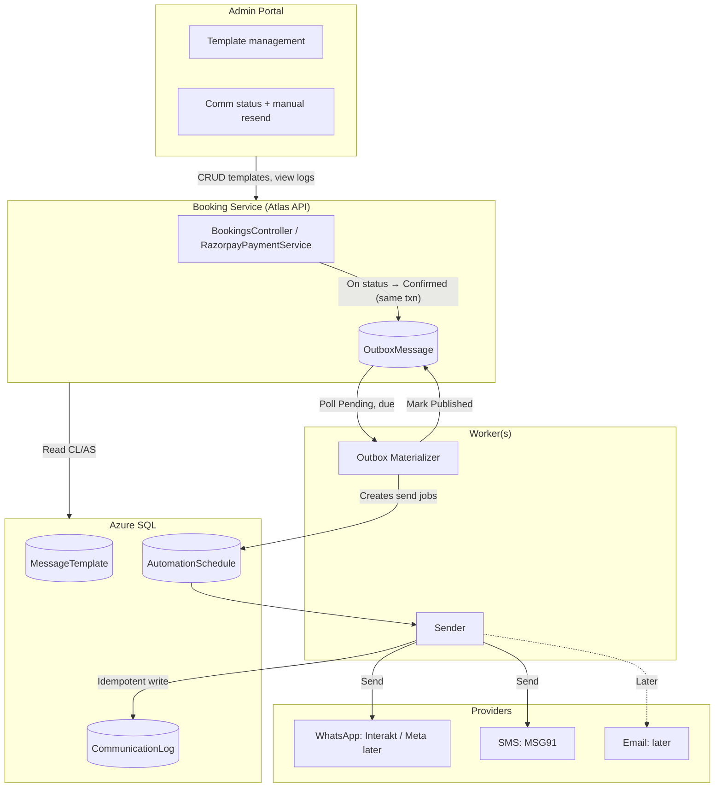

# HLD: Notifications via DB Outbox + Worker

**Purpose:** High-level design for implementing WhatsApp/SMS (and later Email) notifications using a DB-backed Outbox and worker(s), without Service Bus/Kafka.

**Audience:** Platform architects, tech leads

**Last updated:** 2026-02-26

**Related:** [LLD](LLD-notifications-outbox-worker.md) | [README](README.md)

---

## 1. Executive summary

Atlas Homestays will deliver **transactional notifications** (WhatsApp, SMS; Email later) when a booking is **confirmed**, using a **database outbox** and **background worker(s)**. No message broker (Service Bus/Kafka) is required for this release. The system reuses existing tables: **OutboxMessage** (domain events), **MessageTemplate** (per-tenant, per-channel templates), **AutomationSchedule** (send jobs with due time), and **CommunicationLog** (idempotent send record and audit). A **materializer** worker turns outbox events into schedule rows; a **sender** worker processes due schedules, resolves templates, enforces idempotency via CommunicationLog, and calls provider adapters (e.g. Interakt for WhatsApp, MSG91 for SMS). All data is **tenant-scoped** (TenantId). The design is **Channex-ready**: the same outbox/worker pipeline can later consume Channex-originated events (e.g. BookingImported/Updated/Cancelled) without schema changes. Reliability is achieved via **transactional outbox**, **at-least-once processing**, **idempotency keys**, and **retries with backoff**.

---

## 2. Problem statement, goals, non-goals

### Problem

- Guests and operators need timely, reliable notifications (WhatsApp, SMS) when a booking is confirmed.
- The platform must avoid duplicate sends on double-confirm or retries, and must operate without introducing a message broker in the first phase.

### Goals

- Send WhatsApp and SMS on **Booking status transition to Confirmed** (old ≠ Confirmed, new = Confirmed).
- Use **existing DB primitives** (OutboxMessage, MessageTemplate, AutomationSchedule, CommunicationLog); no new tables for core flow.
- **Multi-tenant**: every row carries TenantId; all queries and workers respect tenant isolation.
- **Idempotent sends**: same logical send (booking + event + channel + template) results in at most one provider call, via CommunicationLog unique constraint.
- **Observable**: structured logs, correlation IDs, and dashboard-friendly queries for comm status and outbox health.
- **Indian context**: E.164 phone formatting; SMS DLT awareness where relevant (documented; implementation may defer full DLT integration).

### Non-goals (this release)

- **Service Bus / Kafka**: not required for v1; architecture doc will state when to adopt.
- **Delivery webhooks / fallback**: no post-send delivery status callbacks or automatic fallback channel on failure.
- **Marketing journeys**: no multi-step campaigns or journey orchestration.
- **Complex Channex sync**: no deep Channex event sync in this release; design must be ready for Channex events later.

---

## 3. Architectural overview

**Components:**

| Component | Role |
|-----------|------|
| **Booking Service (Atlas API)** | On booking confirm (payment verify or admin update), within the same DB transaction: update Booking, then insert **OutboxMessage** (Topic e.g. `booking.events`, EventType `booking.confirmed`, PayloadJson, TenantId, EntityId). |
| **Azure SQL** | **OutboxMessage** (events to process), **MessageTemplate** (eventType, channel, body, isActive, scope/language), **AutomationSchedule** (eventType, dueAtUtc, status, attemptCount, lastError, completedAtUtc, BookingId), **CommunicationLog** (channel, eventType, toAddress, templateId, idempotencyKey, providerMessageId, status, sentAtUtc). |
| **Worker(s)** | **Outbox materializer**: polls OutboxMessage (Status=Pending, NextAttemptUtc ≤ now), creates one or more **AutomationSchedule** rows per event (e.g. one per active template/channel for that event), marks OutboxMessage Published/Failed. **Sender**: polls AutomationSchedule (Pending, DueAtUtc ≤ now), resolves template + recipient, ensures idempotency via CommunicationLog, calls provider, writes/updates CommunicationLog, marks Schedule Completed/Failed. |
| **Providers** | **WhatsApp**: Interakt now; Meta (Cloud API) later. **SMS**: MSG91. **Email**: later. |
| **Admin portal** | Template CRUD, view communication status per booking, manual resend (with audit). |

---

## 4. Key design decisions

| Decision | Rationale |
|----------|-----------|
| **DB outbox now** | Avoids broker dependency and operational overhead for v1; reuses existing OutboxMessage table and patterns; keeps confirm and event write in one transaction. |
| **When to adopt Service Bus/Kafka** | Consider when: (1) multiple independent consumers of the same stream, (2) need for cross-service fan-out or replay without hitting app DB, (3) scale or latency requirements exceed poll-based worker. Until then, DB outbox + worker is sufficient. |
| **Outbox → Schedule → Send** | Reuses AutomationSchedule as the "send job" table; keeps a single place (CommunicationLog) for idempotency and audit; allows future delayed or batched sends by setting DueAtUtc. |
| **Idempotency in CommunicationLog** | Unique (TenantId, IdempotencyKey) prevents duplicate sends for the same logical action; key formula differs for "first send" vs "manual resend" (see LLD). |

---

## 5. Reliability model

- **Transactional outbox:** OutboxMessage is written in the **same transaction** as the booking status update. No event is lost if the app crashes after commit; workers process it eventually.
- **At-least-once processing:** Workers may process the same outbox row or schedule row more than once (e.g. after timeout or crash). Idempotency (CommunicationLog) ensures at most one successful send per idempotency key.
- **Retries and backoff:** Outbox and Schedule rows use AttemptCount, LastError, NextAttemptUtc (outbox) / DueAtUtc (schedule). Transient failures trigger retry with configurable backoff; after max attempts, mark Failed and optionally alert (see LLD).
- **Poison messages:** After max retries, mark as Failed; do not block other rows. Ops runbook covers manual inspection and safe replay.

---

## 6. Multi-tenant model

- **TenantId on all entities:** OutboxMessage, MessageTemplate, AutomationSchedule, CommunicationLog (and Booking, Guest) include TenantId. All worker queries **scope by TenantId** (or use tenant-resolved context when processing a single event).
- **Request context:** API resolves tenant from `X-Tenant-Slug` (or configured fallback); new OutboxMessage rows get TenantId from the same context. Workers read TenantId from the outbox/schedule row and never cross tenants in one logical operation.
- **Isolation:** No query returns data for another tenant; admin/ops endpoints must enforce tenant scope (and role) for template CRUD and communication logs.

---

## 7. Channex readiness

- **Future events:** The same pipeline can support Channex-originated events (e.g. BookingImported, BookingUpdated, BookingCancelled) by: (1) writing an OutboxMessage (or equivalent) when Channex webhook or sync delivers the event, (2) using the same materializer/sender and MessageTemplate/CommunicationLog. EventType and payload schema can be extended without changing core table shapes.
- **This release:** No Channex event ingestion is required; only Booking status transition to Confirmed in Atlas API triggers the flow.

---

## 8. Observability

- **Structured logging:** Workers and API log with TenantId, BookingId, EventType, CorrelationId, TemplateId, Channel, and provider result. Use consistent property names for log aggregation.
- **Correlation IDs:** OutboxMessage.CorrelationId (and optional request header) propagated to CommunicationLog.CorrelationId for traceability from confirm → send.
- **Dashboard views:** Queries (or small views) for: outbox pending/failed counts by tenant; schedule pending/failed; communication log status by booking/channel; oldest pending outbox/schedule. LLD specifies exact queries and optional metrics.

---

## 9. Security and compliance overview

- **PII:** Guest phone/email and message content are PII. Stored in Booking/Guest and in template payloads; CommunicationLog holds ToAddress and provider identifiers. Access to CommunicationLog and templates must be tenant-scoped and role-controlled; logs retained per policy.
- **Secrets:** Provider API keys (Interakt, MSG91, etc.) stored in configuration or secret store; never in DB or client. Workers run in a trusted environment with access to secrets.
- **Rate limits:** Providers enforce per-account/per-phone limits. Workers should respect provider rate limits (and optional in-app throttling) to avoid rejections; document in LLD.
- **India (SMS/WhatsApp):** E.164 formatting for Indian numbers (e.g. +91XXXXXXXXXX). SMS: DLT registration and template approval are provider/operator requirements; document in LLD; implementation may stub or defer full DLT flows.

---

## Glossary

| Term | Meaning |
|------|---------|
| **Outbox (transactional outbox)** | Table (OutboxMessage) where domain events are appended in the same transaction as the business write; workers poll and process. |
| **Materializer** | Worker that reads Pending OutboxMessage rows and creates AutomationSchedule (or equivalent) "send jobs". |
| **Sender** | Worker that processes due AutomationSchedule rows, resolves template/recipient, enforces idempotency via CommunicationLog, and calls channel providers. |
| **Idempotency key** | Unique key (e.g. TenantId + IdempotencyKey in CommunicationLog) ensuring the same logical send is not executed twice. |
| **DLT** | Distributed Ledger Technology (India); regulatory requirement for commercial SMS; templates must be registered. |
