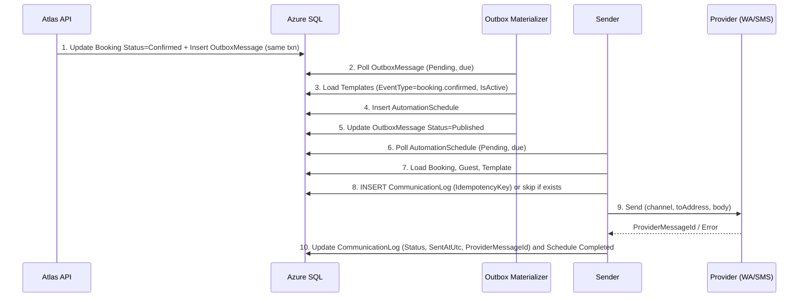

# LLD: Notifications via DB Outbox + Worker

**Purpose:** Low-level, implementable design for data flows, table mapping, worker logic, idempotency/retries, API/UI read paths, ops runbook, and test plan.

**Audience:** Developers implementing notifications

**Last updated:** 2026-02-26

**Related:** [HLD](HLD-notifications-outbox-worker.md) | [README](README.md)

---

## 1. Data model mapping

All concepts map to **existing** tables; no new tables for the core flow.

| Concept | Table(s) | Mapping |
|---------|----------|---------|
| **Template** | MessageTemplate | EventType, Channel, Body, IsActive, TemplateVersion, Language, ScopeType/ScopeId. One row per tenant per (EventType, Channel) (or per scope); used by sender to resolve body and placeholders. |
| **Rule** | (Implicit) | "On BookingConfirmed, send for each active template" is implemented in the **Outbox materializer** and **MessageTemplate** query (EventType = booking.confirmed, IsActive = true). No separate Rule table. |
| **Outbox event** | OutboxMessage | Topic (e.g. `booking.events`), EventType (e.g. `booking.confirmed`), PayloadJson, EntityId (e.g. booking Id), TenantId, Status, NextAttemptUtc, AttemptCount, LastError, CreatedAtUtc, PublishedAtUtc. |
| **Job (send job)** | AutomationSchedule | EventType, DueAtUtc, Status (Pending/Published/Completed/Failed/Cancelled), BookingId, TenantId, AttemptCount, LastError, CompletedAtUtc. **One row per event** (e.g. one per BookingConfirmed); sender loads all active templates for that EventType and sends per channel/template (idempotency via CommunicationLog). |
| **Log (audit + idempotency)** | CommunicationLog | Channel, EventType, ToAddress, TemplateId, TemplateVersion, CorrelationId, **IdempotencyKey** (UNIQUE with TenantId), Provider, ProviderMessageId, Status, SentAtUtc, AttemptCount, LastError, BookingId, GuestId. |

**Optional enhancements (not required for core):**

- OutboxMessage: already has Status, NextAttemptUtc, AttemptCount, LastError.
- CommunicationLog: optional **ProviderRawResponse** column for debugging (if not present, use LastError only).
- New table: none for core; any "NotificationPreference" or "ChannelOverride" could be a future extension.

---

## 2. Event definitions

### 2.1 BookingConfirmed event schema

Emitted when Booking status transitions to Confirmed (old ≠ Confirmed, new = Confirmed). Written in the same transaction as the status update.

**OutboxMessage:**

- Topic: `booking.events`
- EventType: `booking.confirmed`
- EntityId: `{BookingId}` (string)
- PayloadJson (structure below); SchemaVersion: 1

**PayloadJson (canonical):**

```json
{
  "bookingId": 12345,
  "guestId": 678,
  "listingId": 10,
  "bookingStatus": "Confirmed",
  "checkinDate": "2026-03-15T00:00:00Z",
  "checkoutDate": "2026-03-17T00:00:00Z",
  "guestPhone": "+919876543210",
  "guestEmail": "guest@example.com",
  "occurredAtUtc": "2026-02-26T10:00:00Z"
}
```

- **bookingId**, **guestId**, **listingId**: integers.
- **guestPhone**: E.164 (e.g. +91 for India); required for WhatsApp/SMS.
- **guestEmail**: for Email channel later.
- **checkinDate** / **checkoutDate**: ISO 8601; used in template placeholders.
- **occurredAtUtc**: event time.

### 2.2 IdempotencyKey formulas

- **Normal send (from outbox/schedule):**  
  `IdempotencyKey = "{BookingId}:{EventType}:{Channel}:{TemplateId}"`  
  Example: `12345:booking.confirmed:WhatsApp:7`  
  Ensures one successful send per (booking, event, channel, template) even if the same booking is confirmed twice or the worker retries.

- **Manual resend (admin-triggered):**  
  `IdempotencyKey = "manual:{BookingId}:{Channel}:{TemplateId}:{RequestId}"`  
  Where RequestId is a new GUID per resend request. Each manual resend creates a **new** CommunicationLog row and is auditable separately.

---

## 3. Worker algorithms

### 3.1 Outbox → Schedule materializer loop (pseudocode)

```
LOOP (every PollInterval, e.g. 15–30s):
  BEGIN TRANSACTION
  -- Lock and select Pending, due rows (UPDLOCK, READPAST to avoid blocking)
  SELECT TOP BatchSize Id, TenantId, Topic, EventType, EntityId, PayloadJson, CorrelationId
  FROM OutboxMessage WITH (UPDLOCK, READPAST)
  WHERE Status = 'Pending' AND (NextAttemptUtc IS NULL OR NextAttemptUtc <= GETUTCDATE())
  ORDER BY NextAttemptUtc, CreatedAtUtc

  FOR EACH row:
    IF EventType != 'booking.confirmed' (or other handled types): skip or defer
    bookingId = Parse(EntityId)
    Load Booking, Guest for bookingId (same TenantId)
    IF Booking not found OR Guest missing phone/email for needed channels: mark OutboxMessage Failed; LastError = "Missing data"; continue
    Insert one AutomationSchedule (TenantId, BookingId, EventType, DueAtUtc = GETUTCDATE(), Status = 'Pending', AttemptCount = 0)
    Update OutboxMessage: Status = 'Published', PublishedAtUtc = GETUTCDATE(), LastError = NULL
  ON transient failure (e.g. deadlock, timeout):
    Increment AttemptCount; set LastError; set NextAttemptUtc = now + Backoff(AttemptCount)
    IF AttemptCount >= MaxAttempts: Status = 'Failed'
  COMMIT
```

- **Batch size:** e.g. 20–50.
- **Locking:** UPDLOCK + READPAST so other workers skip locked rows; single worker per outbox type can use simpler SELECT without READPAST.
- **TenantId:** Always from OutboxMessage row; all new AutomationSchedule rows get the same TenantId.

### 3.2 Schedule → Provider sender loop (pseudocode)

```
LOOP (every PollInterval, e.g. 15–30s):
  BEGIN TRANSACTION
  SELECT TOP BatchSize Id, TenantId, BookingId, EventType
  FROM AutomationSchedule WITH (UPDLOCK, READPAST)
  WHERE Status = 'Pending' AND DueAtUtc <= GETUTCDATE()
  ORDER BY DueAtUtc

  FOR EACH schedule row:
    Load Booking (with Guest, Listing) for schedule.BookingId, same TenantId
    IF Booking missing or cancelled/expired: mark Schedule Cancelled/Failed; continue
    Load active MessageTemplates for TenantId and EventType = schedule.EventType
    Build payload (flat) from Booking, Guest, Listing for placeholders
    FOR EACH template:
      Resolve ToAddress from Guest (phone for WhatsApp/SMS, email for Email); IF missing skip template
      IdempotencyKey = "{BookingId}:{EventType}:{Channel}:{TemplateId}"
      Try INSERT CommunicationLog (TenantId, BookingId, GuestId, Channel, EventType, ToAddress, TemplateId, TemplateVersion, CorrelationId, IdempotencyKey, Provider, Status='Pending', AttemptCount=0)
      IF unique violation on (TenantId, IdempotencyKey): skip (already sent)
      ELSE:
        Render body = ReplacePlaceholders(Template.Body, payload)
        Call provider.Send(Channel, ToAddress, body, templateKey for DLT if SMS)
        IF success: Update CommunicationLog Status='Sent', ProviderMessageId, SentAtUtc
        IF transient failure: set schedule LastError, AttemptCount++, DueAtUtc = now + Backoff; do not mark Completed (will retry whole schedule; idempotency skips already-sent templates)
        IF permanent failure: Update CommunicationLog Status='Failed', LastError
    If no transient failure: Update Schedule Status='Completed', CompletedAtUtc. If AttemptCount >= MaxAttempts: mark Schedule Failed.
  COMMIT
```

- **Template resolution:** Sender resolves templates by (TenantId, EventType); one schedule row per event; sender iterates over all active templates for that event.
- **Idempotency:** First INSERT into CommunicationLog wins; concurrent workers will hit unique violation and skip send.

### 3.3 SQL locking and failure handling

- **Outbox:** Use `WITH (UPDLOCK, READPAST)` when polling to avoid long blocks; process in small batches; on deadlock/timeout retry with backoff.
- **Schedule:** Same pattern. On send failure, set LastError and (if transient) bump DueAtUtc for retry; on max attempts set Status = 'Failed'.
- **Poison:** Do not retry indefinitely; after MaxAttempts mark Failed and continue. Ops runbook covers replay.

---

## 4. Template rendering contract

### 4.1 Supported placeholders

Resolved from a **flat** payload derived from Booking, Guest, Listing (and event payload). Keys are case-insensitive; use `{{key}}` in template body.

| Placeholder | Source | Example |
|-------------|--------|---------|
| bookingId | Payload / Booking.Id | 12345 |
| guestId | Payload / Guest.Id | 678 |
| listingId | Payload / Listing.Id | 10 |
| guestPhone | Guest.Phone (E.164) | +919876543210 |
| guestEmail | Guest.Email | guest@example.com |
| checkinDate | Booking.CheckinDate | 15-Mar-2026 (or configured format) |
| checkoutDate | Booking.CheckoutDate | 17-Mar-2026 |
| bookingStatus | Booking.BookingStatus | Confirmed |
| guestName | Guest.Name | John Doe |
| listingName | Listing.Name | Cozy Studio |

Nested keys (e.g. `guest.Phone`) can be flattened to `guestPhone` for compatibility with existing ReplacePlaceholders logic.

### 4.2 Validation and fallback

- **Missing placeholder:** Replace with empty string or leave `{{key}}` as-is (configurable); log warning. Do not fail the send for a single missing placeholder.
- **Invalid/missing ToAddress:** Skip send for that channel; log; mark schedule as Failed or Cancelled with reason "No recipient".
- **Template not found:** Mark schedule Failed; LastError = "Template not found".

---

## 5. Provider adapter contract

### 5.1 Interface (prose)

- **WhatsApp sender:** Accepts (toAddress E.164, body or templateKey, optional templateParams). Returns (Success, ProviderMessageId, Error). **Now:** Interakt API. **Later:** Meta Cloud API; same interface, different implementation.
- **SMS sender:** Accepts (toAddress E.164, body, optional DLT template key/entity). Returns (Success, ProviderMessageId, Error). **Now:** MSG91. India: DLT registration and template approval required for commercial SMS; document in provider config; implementation may use approved template key in request.
- **Email sender (later):** Accepts (toAddress, subject, body). Returns (Success, ProviderMessageId, Error).

### 5.2 Error taxonomy and retry eligibility

| Error type | Examples | Retry? | Action |
|------------|----------|--------|--------|
| **Transient** | Network timeout, 5xx, rate limit (429) | Yes | Backoff; increment AttemptCount; set NextAttemptUtc / DueAtUtc. |
| **Permanent** | Invalid number, template rejected, 4xx (client error) | No | Mark Failed; set LastError; do not reschedule. |
| **Unknown** | Unmapped exception | Configurable (e.g. retry once then Failed). |

---

## 6. Admin portal behaviour

### 6.1 Template CRUD

- **List:** GET templates for current tenant; filter by EventType, Channel, IsActive.
- **Get:** Single template by Id (tenant-scoped).
- **Create/Update:** EventType, Channel, Body, IsActive, TemplateVersion, Language, ScopeType/ScopeId (per existing API). Validate placeholders against allowed list; warn if unknown placeholders.
- **Delete (or deactivate):** Set IsActive = false or soft-delete; do not delete if referenced in CommunicationLog (optional constraint).

### 6.2 Booking communications panel

- **Data:** CommunicationLog rows for the booking (BookingId filter); optionally AutomationSchedule for same booking (status, EventType, DueAtUtc, LastError).
- **Display:** Table: Channel, EventType, Template (name/Id), ToAddress (masked if needed), Status, SentAtUtc, AttemptCount, LastError (truncated). Sort by CreatedAtUtc desc.
- **Queries:** GET /api/communication-logs?bookingId={id} (tenant-scoped). GET /api/automation-schedules?bookingId={id} (tenant-scoped).

### 6.3 Manual resend

- **Action:** User selects booking + channel (and optionally template). Backend generates new RequestId, computes IdempotencyKey = `manual:{BookingId}:{Channel}:{TemplateId}:{RequestId}`, creates one AutomationSchedule row (or directly calls sender with manual flag) so that one new CommunicationLog row is created. No duplicate of the *original* send (different key).
- **Audit:** Log "manual resend" in CommunicationLog with distinct IdempotencyKey; optionally store "triggeredBy" (userId) in a column or audit table if available (optional enhancement).

---

## 7. API surface (no code; endpoints and behaviour)

| Endpoint | Method | Scope | Description |
|---------|--------|--------|-------------|
| **Read communication status for a booking** | GET /api/communication-logs?bookingId={id} | Tenant | Returns list of CommunicationLogDto for that booking (tenant-scoped). Internal/admin. |
| **Trigger manual resend** | POST /api/bookings/{id}/resend-notification | Tenant | Body: { channel, templateId? }. Creates send job (e.g. AutomationSchedule or direct send) with manual IdempotencyKey. Admin-only. |
| **Template CRUD** | GET/POST/PUT/DELETE /api/message-templates | Tenant | List, create, update, delete (or deactivate) templates. Admin-only. |
| **List automation schedules for booking** | GET /api/automation-schedules?bookingId={id} | Tenant | For support/diagnostics. Admin or internal. |
| **Ops: outbox list** | GET /ops/outbox?status=&from=&to= | Ops | Read-only list of OutboxMessage (filters: status, date range); pagination. Internal/ops only; no tenant in URL but filter by TenantId in query. |

- **Internal/admin-only:** All of the above require auth and tenant context; only callable from admin portal or backend. Do not expose resend or template mutation to guest-facing APIs.

---

## 8. Backoff and retry policy

- **Default max retries:** 5 (configurable per worker).
- **Backoff schedule:** Exponential: e.g. 1 min, 2 min, 4 min, 8 min, 16 min (or 30s, 1m, 2m, 4m, 8m). NextAttemptUtc (outbox) or DueAtUtc (schedule) = now + backoff(AttemptCount).
- **Poison handling:** After AttemptCount >= MaxAttempts, set Status = 'Failed'; do not process again by normal poll. Ops can manually fix and set Status back to Pending and reset AttemptCount/NextAttemptUtc for replay (see runbook).

---

## 9. Operational runbook

### 9.1 Running workers in DEV/PROD

- **DEV:** Run materializer and sender in-process (e.g. same host as API) or as separate console/hosted services; use same DB and config (with DEV provider keys or stub).
- **PROD:** Run as separate process(es) or same app (HostedService); ensure only one active poller per outbox "type" if using single-instance, or use distributed lock if multiple instances (not required for single-instance deployment).

### 9.2 Diagnosing stuck jobs

- **Outbox stuck:** Query `OutboxMessage WHERE Status = 'Pending'` ordered by NextAttemptUtc; check LastError and AttemptCount. If many Pending with old NextAttemptUtc, worker may be down or overloaded.
- **Schedule stuck:** Query `AutomationSchedule WHERE Status = 'Pending' AND DueAtUtc < GETUTCDATE()`; check LastError. If Failed, inspect LastError for permanent vs transient.
- **CommunicationLog:** Check Status = 'Sent' vs 'Failed'; filter by BookingId for guest support.

### 9.3 Safe replay

- **Outbox:** Only replay if Status = 'Failed' and root cause fixed. Set Status = 'Pending', AttemptCount = 0, NextAttemptUtc = GETUTCDATE(), LastError = NULL. Ensure idempotency keys for downstream sends will not duplicate (e.g. same booking+event+channel+template → same IdempotencyKey → one send).
- **Schedule:** Similarly, set Status = 'Pending', reset AttemptCount and LastError; set DueAtUtc = GETUTCDATE(). Sender will re-run; CommunicationLog unique key prevents duplicate send.

---

## 10. Test plan (acceptance criteria)

| Scenario | Acceptance criteria |
|----------|---------------------|
| **No duplicate sends on double-confirm** | Two OutboxMessage rows for same booking confirm (e.g. double click or retry) → materializer creates schedules for both → sender runs; second send for same (BookingId, EventType, Channel, TemplateId) hits CommunicationLog unique (IdempotencyKey); only one provider call per (booking, event, channel, template). |
| **Retries and final failure** | Simulate transient failure (e.g. provider timeout); worker increments AttemptCount and sets NextAttemptUtc/DueAtUtc; after MaxAttempts, Status = Failed; no further automatic retries. |
| **Tenant isolation** | Create events for Tenant A and B; ensure worker only reads TenantId from row; no cross-tenant data in templates or logs; API filters by tenant. |
| **Manual resend logs separately** | Trigger manual resend for same booking+channel+template; new CommunicationLog row with IdempotencyKey containing "manual" and RequestId; original send row unchanged; both visible in booking communications panel. |
| **Placeholder resolution** | Template with {{guestPhone}}, {{checkinDate}}; payload has guestPhone and checkinDate; body rendered with values; missing placeholder leaves empty or placeholder text per config. |
| **Indian E.164** | Guest.Phone stored as +919876543210; sent to provider without modification; SMS/WhatsApp accept (DLT/template requirements documented separately). |

---

## 11. Sequence diagram (BookingConfirmed → send → log)



---

## Glossary

| Term | Meaning |
|------|---------|
| **Materializer** | Worker that reads OutboxMessage (Pending) and creates AutomationSchedule rows. |
| **Sender** | Worker that processes due AutomationSchedule, resolves template/recipient, enforces idempotency via CommunicationLog, calls provider. |
| **IdempotencyKey** | Unique key per (TenantId) in CommunicationLog; formula differs for normal send vs manual resend. |
| **DLT** | India SMS regulatory; template and entity registration. |
| **E.164** | International phone format (e.g. +919876543210). |
