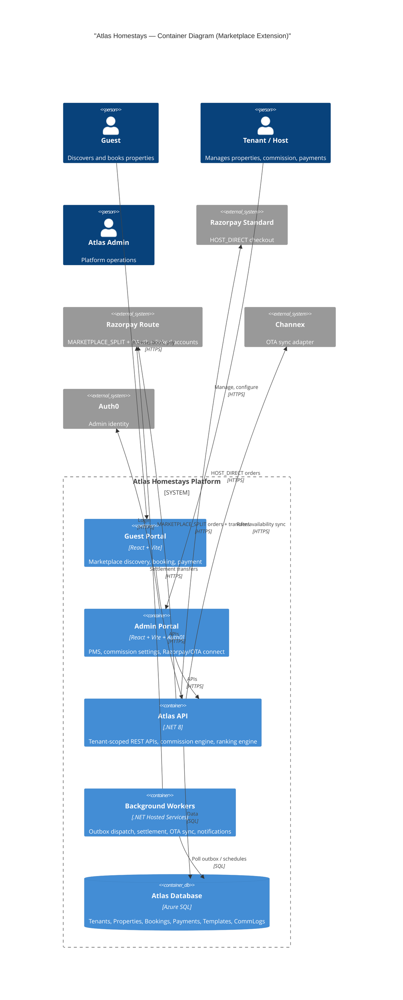
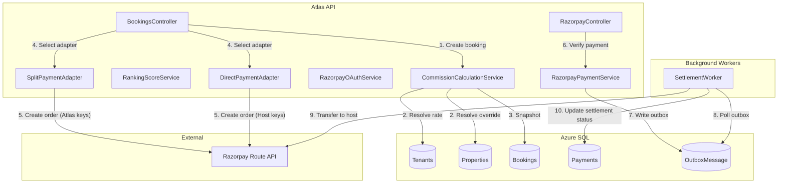

# HLD: Hybrid SaaS + Marketplace — Commission Engine, Payments, OTA, Ranking

**Purpose:** High-level requirements for the marketplace model, commission engine, payment split settlement, OTA integration, and ranking/boost system.

**Audience:** Developers, platform architects, tech leads

**Last updated:** 2026-02-27

**Related:** [LLD](LLD-marketplace-commission-engine.md) | [RA-000](RA-000-marketplace-requirements-plan.md)

---

## 1. Product overview

### 1.1 SaaS + Marketplace hybrid model

Atlas Homestays operates as a **multi-tenant SaaS** platform where property operators (tenants) manage their hospitality business. The marketplace extension adds a **guest-facing discovery layer** at `atlashomestays.com` where properties from multiple tenants are listed, ranked, and bookable with commission-based revenue sharing.

The two models coexist:

| Aspect | SaaS (current) | Marketplace (new) |
|--------|----------------|-------------------|
| Revenue | Subscription plans (BillingPlan) | Commission on bookings |
| Payment flow | Host collects directly via own Razorpay keys | Atlas collects, splits via Razorpay Route |
| Guest discovery | Tenant's own domain / guest portal | `atlashomestays.com/{property-slug}` |
| Pricing control | Host sets all prices | Host sets prices; guest sees same price (commission is host-side) |

### 1.2 Tenant vs Property responsibilities

| Concern | Tenant level | Property level |
|---------|-------------|----------------|
| Commission | `DefaultCommissionPercent` (floor: 1%) | `CommissionPercent` override (>= tenant default) |
| Payment mode | `PaymentMode` (HOST_DIRECT or MARKETPLACE_SPLIT) | Inherited from tenant |
| Razorpay OAuth | Tenant connects once; linked account ID stored | N/A |
| OTA connection | Tenant-level Channex API key | Property-level `ChannelConfig` (external property ID) |
| Marketplace visibility | N/A | `IsMarketplaceEnabled` toggle per property |
| Ranking / boost | N/A | Driven by property-level commission override |

### 1.3 Revenue modes

**HOST_DIRECT** (default, current behaviour):
- Guest pays host's Razorpay account directly.
- Atlas earns via SaaS subscription only.
- Commission fields are tracked for reporting but no split settlement occurs.
- `Booking.PaymentModeSnapshot = "HOST_DIRECT"`.

**MARKETPLACE_SPLIT** (new):
- Guest pays Atlas's Razorpay account.
- Atlas retains commission; host receives remainder via Razorpay Route transfer.
- Requires tenant to complete Razorpay OAuth and have a linked account.
- `Booking.PaymentModeSnapshot = "MARKETPLACE_SPLIT"`.
- Commission is snapshotted at booking creation and never recalculated.

---

## 2. Actors

| Actor | Description | Existing touchpoints |
|-------|-------------|---------------------|
| **Tenant (Host)** | Property operator. Manages properties, listings, pricing, bookings. Sets commission and payment mode. | `Tenant` model, `TenantProfile`, admin portal, `X-Tenant-Slug` header resolution. |
| **Guest** | Searches, books, pays. Sees commission-neutral pricing (same price regardless of commission). | Guest portal (`RatebotaiRepo`), Razorpay Checkout. |
| **Atlas Admin** | Platform operator. Views cross-tenant analytics, manages marketplace policies, reviews KYC. | `PlatformController`, billing domain, KYC controller. |
| **OTA (Airbnb, Booking.com via Channex)** | External booking channels. Rates and availability synced via Channex adapter. | `IChannelManagerProvider`, `ChannexAdapter`, `ChannelConfig` model. |
| **Razorpay** | Payment processor. Standard checkout today; OAuth + Route for split settlement. | `RazorpayPaymentService`, `RazorpayController`, `RazorpayConfig`. |

---

## 3. Core modules

### 3.1 Module inventory (existing vs new)

| Module | Status | Repo(s) | Key files |
|--------|--------|---------|-----------|
| Tenant Management | **Exists; extend** | atlas-api | `Tenant.cs`, `TenantsController.cs`, `TenantProfile.cs` |
| Property Management | **Exists; extend** | atlas-api | `Property.cs`, `PropertiesController.cs` |
| OTA Sync (Channex) | **Exists; extend** | atlas-api | `ChannexAdapter.cs`, `IChannelManagerProvider.cs`, `ChannelConfig.cs` |
| Payment Integration | **Exists; extend** | atlas-api | `RazorpayPaymentService.cs`, `RazorpayController.cs` |
| Commission Engine | **New** | atlas-api | New service: `CommissionCalculationService` |
| Ranking Engine | **New** | atlas-api | New service: `RankingScoreService` |
| Booking Engine | **Exists; extend** | atlas-api | `BookingsController.cs`, `RazorpayPaymentService.cs` |
| Marketplace Visibility | **New** | atlas-api, guest portal | New filter on listings/properties endpoints |

### 3.2 Module descriptions

**Tenant Management** — Add `DefaultCommissionPercent` (decimal, default 1.00), `PaymentMode` (varchar, default `HOST_DIRECT`), and Razorpay OAuth fields to the `Tenants` table. Expose via admin API for tenant self-service.

**Property Management** — Reuse existing `Property.CommissionPercent` as the override field. Add `IsMarketplaceEnabled` (bit, default false). Enforce override >= tenant default via validation.

**OTA Sync (Channex Adapter)** — The existing `IChannelManagerProvider` abstraction already supports provider swapping. Extend `ChannelConfig` to support Airbnb OAuth token storage alongside Channex API key. OTA payouts remain entirely separate from marketplace payouts (OTA pays the host directly per OTA terms; Atlas never touches OTA funds).

**Payment Integration (Razorpay OAuth + Route)** — Add an OAuth consent flow where the tenant authorizes Atlas to create a Razorpay linked account. Store encrypted tokens. On `MARKETPLACE_SPLIT` bookings, use Razorpay Route to split the payment: Atlas retains commission, remainder transferred to the host's linked account.

**Commission Engine** — Calculates the effective commission rate for a booking:
1. Start with tenant's `DefaultCommissionPercent`.
2. If property has `CommissionPercent` override and it is >= tenant default, use it.
3. Floor is always 1% (hardcoded minimum).
4. Result is snapshotted into `Booking.CommissionPercentSnapshot` at creation time.
5. `Booking.CommissionAmount = FinalAmount * CommissionPercentSnapshot / 100`.
6. `Booking.HostPayoutAmount = FinalAmount - CommissionAmount`.

**Ranking Engine** — Scores marketplace-visible properties for search result ordering. Weighted formula:

```
Score = w_base * BaseScore
      + w_commission * log(1 + CommissionPercent) / log(1 + MaxCap)
      + w_reviews * NormalizedReviewScore
      + w_recency * RecencyDecay
```

- `w_commission` is capped (e.g. max 30% weight) to prevent pure pay-to-win.
- Log-based scaling ensures diminishing returns on commission boosts.
- Fairness guardrail: properties with no boost still appear; boost only improves position within the same quality band.

**Booking Engine** — On booking creation: resolve commission via Commission Engine, snapshot into booking fields, select payment adapter (`HOST_DIRECT` uses existing flow; `MARKETPLACE_SPLIT` uses Route-based flow). Existing `CommissionRates.ForSource()` (OTA-based) remains a **separate concern** for revenue reporting on OTA-sourced bookings.

**Marketplace Visibility Engine** — Filters properties where `IsMarketplaceEnabled = true` for the guest-facing marketplace. Properties not opted in remain accessible only via the tenant's own guest portal.

---

## 4. Payment modes

### 4.1 HOST_DIRECT (current default)

```
Guest → Razorpay (Host's account) → Host receives 100%
Atlas earns: subscription fee only
```

- Uses existing `RazorpayConfig` (KeyId/KeySecret) per tenant.
- No split settlement.
- Commission fields populated for reporting only.

### 4.2 MARKETPLACE_SPLIT (new)

```
Guest → Razorpay (Atlas's account) → Route split:
  - Atlas retains: CommissionAmount
  - Host receives: HostPayoutAmount → transferred to linked account
```

- Requires tenant to have completed Razorpay OAuth (linked account created).
- Uses Atlas's master Razorpay keys for order creation.
- On payment capture, Razorpay Route transfers `HostPayoutAmount` to the tenant's linked account.
- Atlas retains `CommissionAmount` in its own settlement.

### 4.3 Mode selection rules

| Condition | Payment mode used |
|-----------|-------------------|
| `Tenant.PaymentMode = HOST_DIRECT` | HOST_DIRECT (always) |
| `Tenant.PaymentMode = MARKETPLACE_SPLIT` AND linked account valid | MARKETPLACE_SPLIT |
| `Tenant.PaymentMode = MARKETPLACE_SPLIT` AND linked account missing/expired | **Block booking creation**; prompt tenant to reconnect Razorpay |

---

## 5. Commission model

### 5.1 Commission hierarchy

```
Effective rate = MAX(
  1.00,                                  -- absolute floor
  Property.CommissionPercent             -- if set and >= tenant default
    ?? Tenant.DefaultCommissionPercent   -- fallback to tenant default
    ?? 1.00                              -- system default
)
```

### 5.2 Snapshot at booking time

When a booking is created:

1. Resolve effective commission rate (hierarchy above).
2. Write to `Booking.CommissionPercentSnapshot`.
3. Calculate `Booking.CommissionAmount = FinalAmount * CommissionPercentSnapshot / 100`.
4. Calculate `Booking.HostPayoutAmount = FinalAmount - CommissionAmount`.
5. Write to `Booking.PaymentModeSnapshot` (the tenant's current `PaymentMode`).

These values are **immutable** after booking creation. If the tenant or property changes commission later, existing bookings are not affected.

### 5.3 Boost impact on ranking

A property that sets a higher commission override "boosts" its marketplace ranking. The boost is **not linear** — it uses logarithmic scaling so that increasing from 1% to 5% has a larger relative impact than increasing from 15% to 20%.

**Boost slider logic (admin UI):**

| Slider position | Commission override | Ranking impact |
|----------------|--------------------:|----------------|
| Default | 1% (tenant default) | No boost |
| Low boost | 3% | Moderate improvement |
| Medium boost | 5% | Good improvement |
| High boost | 10% | Strong improvement (diminishing returns begin) |
| Max boost | 20% (configurable cap) | Maximum improvement (capped) |

**Fairness guardrails:**
- Commission weight is capped at 30% of total ranking score.
- Properties with zero boost still rank based on quality signals (reviews, recency, occupancy).
- No property is hidden due to low commission; ordering is influenced, not gated.

---

## 6. Marketplace strategy

### 6.1 URL structure

```
atlashomestays.com/                        → marketplace homepage (search)
atlashomestays.com/{property-slug}         → property detail page
atlashomestays.com/{property-slug}/book   → booking flow
```

- Property slugs are globally unique (derived from property name + tenant, e.g. `cozy-villa-goa-atlas`).
- SEO: each property page is indexable with structured data (JSON-LD for `LodgingBusiness`).
- Canonical URL prevents duplicate content between tenant's own domain and marketplace.

### 6.2 Listing eligibility

A property appears on the marketplace when ALL conditions are met:

1. `Property.IsMarketplaceEnabled = true`
2. `Property.Status = "Active"`
3. Tenant's subscription is active (not suspended/canceled)
4. Property has at least one active listing with pricing configured

### 6.3 Guest pricing transparency

- **Commission is host-side only.** The guest always sees the same price regardless of commission percentage.
- A property priced at INR 5,000/night shows INR 5,000 to the guest whether the host's commission is 1% or 20%.
- Atlas earns from the host's share, not as a markup on the guest price.

---

## 7. Non-functional requirements

| Requirement | Approach |
|-------------|----------|
| **Idempotency** | Reuse existing outbox pattern (`OutboxMessage` + `CommunicationLog.IdempotencyKey`). Split settlement requests must be idempotent (use Razorpay transfer idempotency key). |
| **Retry logic** | Existing exponential backoff in `OutboxDispatcherHostedService` and `AutomationSchedulerHostedService`. Split settlement failures retry with backoff; max 5 attempts. |
| **Outbox pattern** | Commission snapshot and split settlement intent recorded in same DB transaction as booking. Settlement execution is async via worker. |
| **Audit logging** | All commission calculations, payment mode selections, split settlement requests/results logged with structured fields (TenantId, BookingId, CommissionPercent, PaymentMode). |
| **Secure token storage** | Razorpay OAuth access/refresh tokens encrypted at rest using .NET Data Protection API (AES-256). Never stored in plaintext. Never returned in API responses. |
| **Minimal downtime rollout** | Feature-flagged. `HOST_DIRECT` remains default. `MARKETPLACE_SPLIT` opt-in per tenant. No breaking changes to existing booking flow. |
| **Backward compatibility** | Existing bookings unaffected. `CommissionPercentSnapshot` and `PaymentModeSnapshot` nullable; null = legacy booking (pre-marketplace). Existing `CommissionRates.ForSource()` for OTA reporting untouched. |
| **Scalability** | Commission calculation is O(1) per booking. Ranking score is O(N) over marketplace properties (cacheable). Must support 100k tenants. |

---

## 8. Risk and edge cases

| Risk | Impact | Mitigation |
|------|--------|------------|
| **Tenant changes commission mid-month** | Existing bookings must not be recalculated. | Commission is snapshotted at booking creation. Admin UI shows warning modal: "This change affects future bookings only." |
| **Property override removed** | Property falls back to tenant default. | On `CommissionPercent = null`, resolve to `Tenant.DefaultCommissionPercent`. Existing bookings retain their snapshot. |
| **Payment mode switch (HOST_DIRECT ↔ MARKETPLACE_SPLIT)** | In-flight bookings (PaymentPending) could be in wrong mode. | Snapshot `PaymentModeSnapshot` at order creation. Once snapshotted, mode is locked for that booking regardless of subsequent tenant changes. |
| **Razorpay OAuth token expiry** | Split settlement fails for new bookings. | Background job refreshes tokens before expiry (token has ~15 min validity; refresh daily). On failure, block new `MARKETPLACE_SPLIT` bookings and notify tenant. |
| **Split settlement failure** | Host does not receive payout. | Retry with backoff (max 5). If permanently failed, log as `SettlementFailed`, alert Atlas Admin for manual resolution. Never auto-refund guest for settlement failure. |
| **OTA sync delay** | Channex rate/availability push delayed; overbooking possible. | Existing `ICalSyncHostedService` and `ChannelConfig.LastSyncError` provide monitoring. OTA payouts are entirely separate from marketplace payouts. |
| **Overbooking conflict** | Same dates booked on OTA and marketplace simultaneously. | Existing `AvailabilityBlock` enforcement prevents double booking within Atlas. iCal sync and Channex push reduce but cannot eliminate external conflicts. |
| **Commission < 1% attempted** | Financial model breaks. | Validation: `DefaultCommissionPercent >= 1.00`, `Property.CommissionPercent >= Tenant.DefaultCommissionPercent`. Enforced in API and UI. |

---

## 9. Architectural overview

### 9.1 C4 Level 2 — Container diagram (extended for marketplace)



### 9.2 C4 Level 3 — Commission and payment components



---

## Glossary

| Term | Definition |
|------|-----------|
| **HOST_DIRECT** | Payment mode where the guest pays the host's Razorpay account directly; no split settlement. |
| **MARKETPLACE_SPLIT** | Payment mode where the guest pays Atlas's Razorpay account; commission retained, remainder transferred to host via Route. |
| **Commission snapshot** | The commission percentage and amounts captured at booking creation time; immutable for that booking. |
| **Razorpay Route** | Razorpay's split payment product that transfers funds to linked accounts. |
| **Razorpay OAuth** | OAuth 2.0 flow where a tenant authorizes Atlas to manage payments on their behalf, creating a linked account. |
| **Linked account** | A Razorpay sub-merchant account created via Route, tied to a tenant, receiving settlement transfers. |
| **Boost** | Higher property-level commission that improves marketplace ranking (log-scaled, capped). |
| **Fairness guardrail** | Constraints ensuring ranking is not purely pay-to-win (commission weight capped, quality signals included). |
| **OTA** | Online Travel Agency (Airbnb, Booking.com, etc.); integrated via Channex. OTA payouts are separate from marketplace payouts. |
| **Outbox pattern** | Transactional outbox (`OutboxMessage`) ensuring domain events are reliably published for async processing. |
