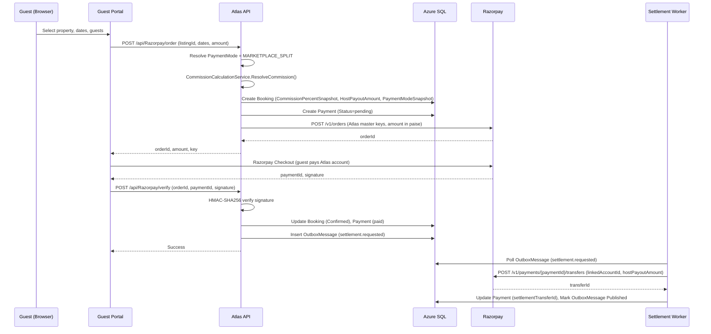
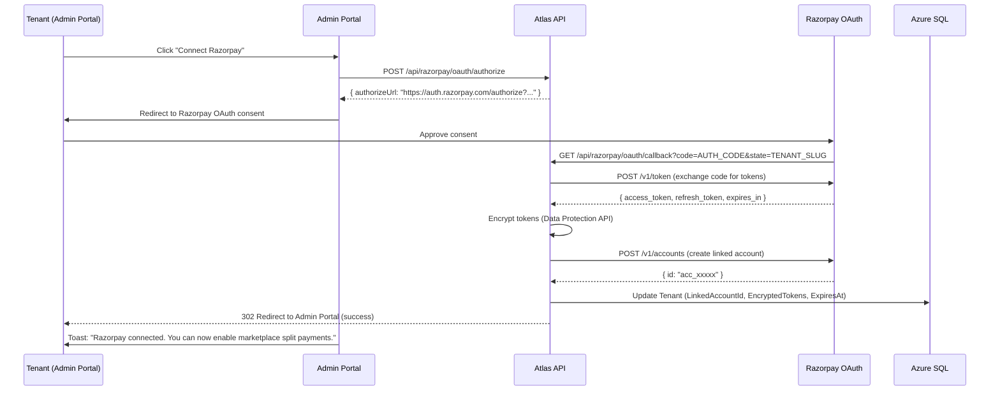
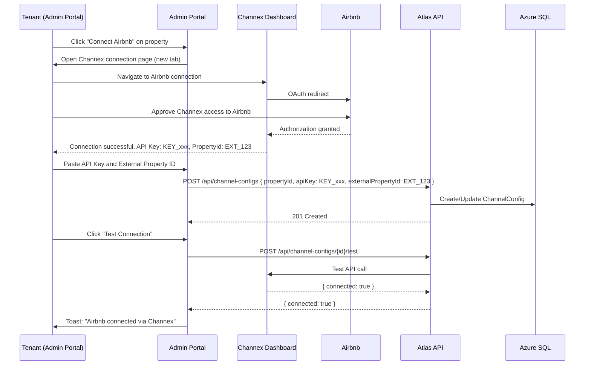

# LLD: Hybrid SaaS + Marketplace — Implementation Requirements

**Purpose:** Low-level, implementable requirements for schema, API services, admin portal, guest portal, observability, rollout, and testing.

**Audience:** Developers

**Last updated:** 2026-02-27

**Related:** [HLD](HLD-marketplace-commission-engine.md) | [RA-000](RA-000-marketplace-requirements-plan.md)

---

## A. Atlas SQL — Schema updates

### A.1 Tenant table additions

| Column | Type | Nullable | Default | Notes |
|--------|------|----------|---------|-------|
| `DefaultCommissionPercent` | decimal(5,2) | No | 1.00 | Floor: 1.00. Validated in API. |
| `PaymentMode` | varchar(30) | No | `'HOST_DIRECT'` | Allowed: `HOST_DIRECT`, `MARKETPLACE_SPLIT`. |
| `RazorpayLinkedAccountId` | varchar(100) | Yes | NULL | Populated after successful Razorpay OAuth. |
| `RazorpayAccessTokenEncrypted` | varbinary(max) | Yes | NULL | AES-256 encrypted via .NET Data Protection API. |
| `RazorpayRefreshTokenEncrypted` | varbinary(max) | Yes | NULL | AES-256 encrypted. |
| `RazorpayTokenExpiresAtUtc` | datetime | Yes | NULL | When the access token expires. |

**Migration name:** `AddMarketplaceFieldsToTenants`

**SQL (conceptual):**

```sql
ALTER TABLE Tenants ADD
  DefaultCommissionPercent decimal(5,2) NOT NULL DEFAULT 1.00,
  PaymentMode varchar(30) NOT NULL DEFAULT 'HOST_DIRECT',
  RazorpayLinkedAccountId varchar(100) NULL,
  RazorpayAccessTokenEncrypted varbinary(max) NULL,
  RazorpayRefreshTokenEncrypted varbinary(max) NULL,
  RazorpayTokenExpiresAtUtc datetime NULL;
```

### A.2 Property table additions

| Column | Type | Nullable | Default | Notes |
|--------|------|----------|---------|-------|
| `IsMarketplaceEnabled` | bit | No | 0 | Toggle for marketplace visibility. |

**Existing column reused:** `CommissionPercent` (decimal(5,2), nullable) — already exists on `Properties`. Semantics: when set, acts as the commission override. When NULL, tenant default applies.

**Migration name:** `AddMarketplaceFieldsToProperties`

```sql
ALTER TABLE Properties ADD
  IsMarketplaceEnabled bit NOT NULL DEFAULT 0;
```

### A.3 Booking table additions

| Column | Type | Nullable | Default | Notes |
|--------|------|----------|---------|-------|
| `CommissionPercentSnapshot` | decimal(5,2) | Yes | NULL | Snapshotted at booking creation. NULL = legacy booking. |
| `HostPayoutAmount` | decimal(18,2) | Yes | NULL | FinalAmount - CommissionAmount. |
| `PaymentModeSnapshot` | varchar(30) | Yes | NULL | `HOST_DIRECT` or `MARKETPLACE_SPLIT`. NULL = legacy. |

**Existing column reused:** `CommissionAmount` (decimal(18,2), nullable) — already exists on `Bookings`.

**Migration name:** `AddMarketplaceFieldsToBookings`

```sql
ALTER TABLE Bookings ADD
  CommissionPercentSnapshot decimal(5,2) NULL,
  HostPayoutAmount decimal(18,2) NULL,
  PaymentModeSnapshot varchar(30) NULL;
```

### A.4 Indexing strategy

| Index | Table | Columns | Purpose |
|-------|-------|---------|---------|
| `IX_Tenants_PaymentMode` | Tenants | (PaymentMode) | Filter tenants by mode for admin queries. |
| `IX_Properties_Marketplace` | Properties | (IsMarketplaceEnabled, Status) | Fast marketplace listing query. |
| `IX_Bookings_PaymentMode` | Bookings | (TenantId, PaymentModeSnapshot) | Settlement worker: find MARKETPLACE_SPLIT bookings. |

### A.5 Migration strategy

1. Create EF Core migration with `AddColumn` operations only (no data loss).
2. All new columns have safe defaults (`1.00`, `HOST_DIRECT`, `0`, `NULL`).
3. Apply via `dotnet ef database update` in the existing migration pipeline.

### A.6 Backfill logic

- **Tenants:** All existing tenants get `DefaultCommissionPercent = 1.00`, `PaymentMode = 'HOST_DIRECT'`. No Razorpay linked account (NULL).
- **Properties:** All existing properties get `IsMarketplaceEnabled = false`. Existing `CommissionPercent` values (if any) are retained as overrides.
- **Bookings:** No backfill. New columns are nullable; NULL means pre-marketplace booking. Existing `CommissionAmount` values (if any) are untouched.

---

## B. Atlas API (.NET Core)

### B.1 Domain models

**Tenant.cs** — Add properties:

```
DefaultCommissionPercent : decimal (default 1.00m)
PaymentMode : string (default "HOST_DIRECT")
RazorpayLinkedAccountId : string?
RazorpayAccessTokenEncrypted : byte[]?
RazorpayRefreshTokenEncrypted : byte[]?
RazorpayTokenExpiresAtUtc : DateTime?
```

**Property.cs** — Add property:

```
IsMarketplaceEnabled : bool (default false)
```

(`CommissionPercent` already exists.)

**Booking.cs** — Add properties:

```
CommissionPercentSnapshot : decimal?
HostPayoutAmount : decimal?
PaymentModeSnapshot : string?
```

(`CommissionAmount` already exists.)

### B.2 Commission Calculation Service

**New service: `CommissionCalculationService`**

Responsibility: Given a booking context (tenant, property), resolve the effective commission rate and compute amounts.

**Interface (prose):**

```
ResolveCommission(tenantId, propertyId, finalAmount)
  → { EffectiveRate, CommissionAmount, HostPayoutAmount }
```

**Algorithm:**

1. Load `Tenant.DefaultCommissionPercent` for the booking's tenant.
2. Load `Property.CommissionPercent` for the booking's property.
3. If property override is set AND >= tenant default: `effectiveRate = property.CommissionPercent`.
4. Else: `effectiveRate = tenant.DefaultCommissionPercent`.
5. Enforce floor: `effectiveRate = MAX(effectiveRate, 1.00)`.
6. `commissionAmount = ROUND(finalAmount * effectiveRate / 100, 2)`.
7. `hostPayoutAmount = finalAmount - commissionAmount`.
8. Return all three values.

**Validation rules:**

- `Tenant.DefaultCommissionPercent >= 1.00` — enforced on update.
- `Property.CommissionPercent` (if set) `>= Tenant.DefaultCommissionPercent` — enforced on update.
- `effectiveRate` is always `>= 1.00`.

### B.3 Ranking Score Service

**New service: `RankingScoreService`**

Responsibility: Score marketplace-visible properties for search ordering.

**Interface (prose):**

```
CalculateScores(properties[])
  → { PropertyId, Score }[]
```

**Weighted scoring formula:**

```
Score = (w_base * BaseScore)
      + (w_commission * CommissionBoost)
      + (w_reviews * ReviewScore)
      + (w_recency * RecencyScore)
```

**Weight defaults (configurable):**

| Weight | Default | Constraint |
|--------|---------|------------|
| `w_base` | 0.30 | Base quality (completeness, photos, pricing) |
| `w_commission` | 0.25 | Capped at 0.30 max |
| `w_reviews` | 0.25 | Average review rating normalized 0-1 |
| `w_recency` | 0.20 | Decay function on last booking date |
| **Total** | **1.00** | Must sum to 1.0 |

**Log-based boost scaling:**

```
CommissionBoost = log(1 + effectiveCommissionPercent) / log(1 + MaxCommissionCap)
```

- `MaxCommissionCap = 20` (configurable).
- Result is normalized to 0-1.
- At 1%: `log(2)/log(21) = 0.23` — low boost.
- At 5%: `log(6)/log(21) = 0.59` — moderate boost.
- At 10%: `log(11)/log(21) = 0.79` — strong boost.
- At 20%: `log(21)/log(21) = 1.00` — maximum boost.

**Base score components:**

| Signal | Score range | How computed |
|--------|-----------|--------------|
| Profile completeness | 0-1 | (photos > 0 ? 0.3 : 0) + (description ? 0.2 : 0) + (pricing ? 0.3 : 0) + (amenities ? 0.2 : 0) |
| Review average | 0-1 | avg(review.rating) / 5.0; 0 if no reviews |
| Recency | 0-1 | 1.0 if booked within 7 days; linear decay to 0 at 90 days |

**Caching:** Ranking scores can be cached (e.g. 15-minute TTL) since they change infrequently. Invalidate on commission change or new review.

### B.4 Razorpay Integration Layer

#### B.4.1 OAuth flow

**New service: `RazorpayOAuthService`**

1. **Initiate:** Admin portal calls `POST /api/razorpay/oauth/authorize` → returns Razorpay OAuth consent URL.
2. **Callback:** Razorpay redirects to `GET /api/razorpay/oauth/callback?code={authCode}`.
3. **Exchange:** API exchanges auth code for access/refresh tokens via Razorpay OAuth API.
4. **Create linked account:** Using the access token, call Razorpay Route API to create a linked account for the tenant.
5. **Store:** Encrypt tokens (Data Protection API), store `RazorpayLinkedAccountId`, `RazorpayAccessTokenEncrypted`, `RazorpayRefreshTokenEncrypted`, `RazorpayTokenExpiresAtUtc` on Tenant.
6. **Tenant update:** Set `PaymentMode = 'MARKETPLACE_SPLIT'` (or let tenant choose separately).

**Token refresh:**

- Background job checks `RazorpayTokenExpiresAtUtc` and refreshes tokens before expiry.
- On refresh failure: log error, set `PaymentMode` back to `HOST_DIRECT`, notify tenant via admin portal.

#### B.4.2 Token storage encryption

- Use `IDataProtector` from .NET Data Protection API.
- Purpose string: `"RazorpayOAuthTokens"`.
- Encrypt before writing to DB; decrypt when needed for API calls.
- Never return tokens in API responses or logs.

#### B.4.3 Route linked account creation

**Razorpay Route API call (prose):**

```
POST https://api.razorpay.com/v1/accounts
{
  "email": tenant.OwnerEmail,
  "phone": tenant.OwnerPhone,
  "legal_business_name": tenantProfile.LegalName,
  "business_type": tenantProfile.BusinessType,
  "contact_name": tenant.OwnerName
}
→ { "id": "acc_xxxxx" }
```

Store `acc_xxxxx` as `Tenant.RazorpayLinkedAccountId`.

#### B.4.4 Split settlement request model

On `MARKETPLACE_SPLIT` booking payment capture:

```
POST https://api.razorpay.com/v1/payments/{paymentId}/transfers
{
  "transfers": [
    {
      "account": tenant.RazorpayLinkedAccountId,
      "amount": hostPayoutAmountInPaise,
      "currency": "INR",
      "notes": {
        "bookingId": booking.Id,
        "tenantId": booking.TenantId,
        "commissionPercent": booking.CommissionPercentSnapshot
      }
    }
  ]
}
```

- `hostPayoutAmountInPaise = Booking.HostPayoutAmount * 100` (Razorpay uses paise).
- Idempotency key: `"settlement:{BookingId}:{PaymentId}"`.
- On success: record transfer ID on Payment row.
- On failure: retry via settlement worker (outbox pattern).

### B.5 Booking flow updates

**On booking creation (CreateBookingRequest or Razorpay order creation):**

1. Resolve `PaymentMode` from `Tenant.PaymentMode`.
2. If `MARKETPLACE_SPLIT` and `RazorpayLinkedAccountId` is null: return 400 "Razorpay account not connected".
3. Call `CommissionCalculationService.ResolveCommission(tenantId, propertyId, finalAmount)`.
4. Set `Booking.CommissionPercentSnapshot`, `Booking.CommissionAmount`, `Booking.HostPayoutAmount`, `Booking.PaymentModeSnapshot`.
5. If `HOST_DIRECT`: use existing `RazorpayPaymentService` flow (host's Razorpay keys).
6. If `MARKETPLACE_SPLIT`: use Atlas's master Razorpay keys for order creation; settlement handled post-capture.

**On payment verification (existing `VerifyAndProcessPaymentAsync`):**

- After marking booking `Confirmed`, check `PaymentModeSnapshot`.
- If `MARKETPLACE_SPLIT`: write an `OutboxMessage` with EventType `settlement.requested` containing BookingId, PaymentId, HostPayoutAmount, LinkedAccountId.
- Settlement worker picks up and executes the Razorpay Route transfer.

**Coexistence with `CommissionRates.ForSource()`:**

- The existing OTA-based commission rates in `CommissionRates.cs` serve a different purpose: they estimate OTA fees for revenue reporting when `BookingSource` is "airbnb", "booking.com", etc.
- Marketplace commission is a separate concept: Atlas's own commission on marketplace bookings.
- Both values can coexist on the same booking if an OTA-sourced booking comes through the marketplace (unlikely initially but architecturally possible).

### B.6 OTA sync layer

**Existing:** `IChannelManagerProvider` → `ChannexAdapter` → `IChannexService`. Property-level `ChannelConfig` with `ApiKey`, `ExternalPropertyId`.

**Extension for Airbnb OAuth (via Channex):**

Channex handles the Airbnb OAuth flow and provides an API key per property/group. The flow from Atlas's perspective:

1. Tenant clicks "Connect Airbnb" in admin portal.
2. Admin portal redirects to Channex's Airbnb connection page (URL constructed from Channex docs).
3. After successful connection, Channex provides a callback or the tenant pastes the API key.
4. Atlas stores the API key in `ChannelConfig` (existing model; `Provider = 'channex'`).
5. Rate and availability sync continues via existing `IChannelManagerProvider.PushRatesAsync` / `PushAvailabilityAsync`.

**Key constraint:** OTA payouts flow directly from the OTA to the host. Atlas never touches OTA funds. The `ChannelConfig` and commission model are independent systems.

### B.7 Validation rules

| Rule | Enforcement | Error |
|------|-------------|-------|
| `DefaultCommissionPercent >= 1.00` | API + DB CHECK constraint | 400: "Commission must be at least 1%" |
| `Property.CommissionPercent >= Tenant.DefaultCommissionPercent` (when set) | API validation | 400: "Override must be >= tenant default ({default}%)" |
| `PaymentMode` in (`HOST_DIRECT`, `MARKETPLACE_SPLIT`) | API + DB CHECK constraint | 400: "Invalid payment mode" |
| `MARKETPLACE_SPLIT` requires `RazorpayLinkedAccountId` | API validation on booking creation | 400: "Razorpay account not connected" |
| `CommissionPercentSnapshot` is immutable | No update endpoint modifies it | N/A (field is set once at creation) |

### B.8 API contracts

#### Tenant commission and payment settings

| Endpoint | Method | Auth | Body / Params | Response |
|----------|--------|------|---------------|----------|
| `PUT /tenants/commission` | PUT | Admin | `{ defaultCommissionPercent: decimal }` | 200: Updated tenant DTO |
| `PUT /tenants/payment-mode` | PUT | Admin | `{ paymentMode: "HOST_DIRECT" \| "MARKETPLACE_SPLIT" }` | 200: Updated tenant DTO |

#### Property commission and marketplace

| Endpoint | Method | Auth | Body / Params | Response |
|----------|--------|------|---------------|----------|
| `PUT /properties/{id}/commission` | PUT | Admin | `{ commissionPercent: decimal? }` | 200: Updated property DTO. null = remove override. |
| `PUT /properties/{id}/marketplace` | PUT | Admin | `{ isMarketplaceEnabled: bool }` | 200: Updated property DTO |

#### Razorpay OAuth

| Endpoint | Method | Auth | Body / Params | Response |
|----------|--------|------|---------------|----------|
| `POST /api/razorpay/oauth/authorize` | POST | Admin | (none) | 200: `{ authorizeUrl: string }` |
| `GET /api/razorpay/oauth/callback` | GET | System | `?code={authCode}&state={tenantSlug}` | 302: Redirect to admin portal with success/error |
| `DELETE /api/razorpay/oauth/disconnect` | DELETE | Admin | (none) | 200: Clears linked account, sets mode to HOST_DIRECT |

#### OTA connection

| Endpoint | Method | Auth | Body / Params | Response |
|----------|--------|------|---------------|----------|
| `POST /api/channel-configs` | POST | Admin | Existing: `{ propertyId, apiKey, externalPropertyId }` | 201: ChannelConfig DTO |
| `POST /api/channel-configs/{id}/test` | POST | Admin | (none) | 200: `{ connected: bool, error?: string }` |

#### Marketplace listings (guest-facing)

| Endpoint | Method | Auth | Body / Params | Response |
|----------|--------|------|---------------|----------|
| `GET /marketplace/properties` | GET | Public | `?location=&checkIn=&checkOut=&guests=&page=&pageSize=` | 200: Ranked list of `MarketplacePropertyDto` |
| `GET /marketplace/properties/{slug}` | GET | Public | (none) | 200: `MarketplacePropertyDetailDto` |

### B.9 Security considerations

- **Encrypt Razorpay tokens:** `IDataProtector` with purpose `"RazorpayOAuthTokens"`. Encrypted at rest. Decrypted only in `RazorpayOAuthService` for API calls.
- **Prevent commission tampering:** Commission is resolved server-side only. No client-supplied commission in booking creation request. `CommissionPercentSnapshot` is write-once (no update endpoint).
- **Audit log:** Every commission calculation, payment mode selection, OAuth connect/disconnect, and settlement attempt is logged with structured fields. Consider a dedicated `AuditLog` table or structured log entries (TenantId, Action, OldValue, NewValue, Timestamp, UserId).
- **Rate limiting:** Razorpay OAuth endpoints rate-limited to prevent abuse. Settlement worker respects Razorpay API rate limits.

---

## C. Atlas Admin Portal

### C.1 Tenant settings (new page or section)

**Location:** New page at `/settings` or section within existing tenant config.

**Fields:**

| Field | Control | Validation | Notes |
|-------|---------|------------|-------|
| Default commission % | Number input (min: 1, step: 0.01) | >= 1.00 | Shows current value. On change, shows warning modal. |
| Payment mode | Radio group: `HOST_DIRECT` / `MARKETPLACE_SPLIT` | MARKETPLACE_SPLIT requires linked account | MARKETPLACE_SPLIT option disabled until Razorpay connected. |

**Commission change warning modal:**

> "Changing the default commission from X% to Y% will affect **future bookings only**. Existing bookings retain their original commission rate. Properties with overrides below Y% will be adjusted to Y% automatically. Continue?"

### C.2 Property settings (extend existing)

**Location:** Extend existing Properties page / property edit form.

**Fields:**

| Field | Control | Validation | Notes |
|-------|---------|------------|-------|
| Commission override | Slider (1%-20%) + number input | >= tenant default; empty = use default | Shows effective rate. Explains boost impact. |
| Marketplace visible | Toggle switch | — | "List this property on atlashomestays.com marketplace" |
| Boost explanation | Read-only info text | — | "Higher commission improves your marketplace ranking. Current boost level: Low/Medium/High." |
| Ranking preview | Read-only indicator | — | Shows estimated ranking band (e.g. "Top 10%", "Top 25%"). |

### C.3 Razorpay connect button

**Location:** Tenant settings page.

**Behaviour:**

1. Button: "Connect Razorpay" (if no linked account) or "Razorpay Connected ✓ (Disconnect)" if connected.
2. On click: calls `POST /api/razorpay/oauth/authorize`, opens returned URL in popup/redirect.
3. After OAuth callback: admin portal receives redirect with success/error query param. Shows toast.
4. On disconnect: calls `DELETE /api/razorpay/oauth/disconnect`. Confirms via modal. Resets payment mode to HOST_DIRECT.

### C.4 OTA connect buttons

**Location:** Existing Channel Manager page (`/channels`).

**Behaviour (Airbnb via Channex):**

1. Button: "Connect Airbnb" per property.
2. Opens Channex Airbnb connection flow (external URL) in new tab.
3. After connection, user pastes the Channex API key and external property ID into the existing `ChannelConfig` form.
4. Test connection button verifies via `POST /api/channel-configs/{id}/test`.

### C.5 Commission change warning modal

Shown when:
- Tenant changes `DefaultCommissionPercent`.
- Property `CommissionPercent` is changed or removed.
- Payment mode is switched.

Content explains that changes are forward-only (existing bookings unaffected).

---

## D. Atlas Guest Portal (RatebotaiRepo)

### D.1 Path-based routing

**Current routes:**

```
/homes/:propertySlug/:unitSlug → PropertyDetails
/search → SearchPage
```

**New marketplace routes:**

```
/                          → MarketplaceHome (search + featured properties)
/search                    → MarketplaceSearch (ranked results)
/{property-slug}           → MarketplacePropertyDetail
/{property-slug}/book      → MarketplaceBookingFlow
```

- Existing tenant-specific routes (`/homes/...`) remain for tenants using their own domain.
- Marketplace routes only render when the host is `atlashomestays.com`.
- Property slug must be globally unique; generate as `{property-name}-{city}-{tenant-slug}` (e.g. `cozy-villa-goa-atlas`).

### D.2 Property page visibility filter

- Marketplace search endpoint `GET /marketplace/properties` only returns properties where `IsMarketplaceEnabled = true`, `Status = 'Active'`, and tenant subscription is active.
- Guest portal calls this endpoint (not the tenant-scoped `/properties` endpoint).

### D.3 Ranking sort integration

- Search results sorted by ranking score (from `RankingScoreService`).
- Default sort: "Recommended" (by score).
- Alternative sorts: "Price: Low to High", "Price: High to Low", "Newest".

### D.4 Boost badge UI

- Properties with commission override > tenant default show a subtle "Featured" or "Promoted" badge.
- Badge is purely cosmetic; does not reveal the commission percentage.
- Design: small pill badge, muted color, positioned on the property card thumbnail.

### D.5 Commission-neutral guest pricing display

- Guest always sees the full property price (set by host).
- No commission surcharge or markup.
- Price breakdown shows: nightly rate, taxes/fees, total — never commission.
- The commission split is internal between Atlas and host.

---

## E. Logging and observability

### E.1 Commission calculation logs

Every commission resolution logs (structured):

```json
{
  "event": "CommissionResolved",
  "tenantId": 42,
  "propertyId": 7,
  "bookingId": 1234,
  "tenantDefault": 1.00,
  "propertyOverride": 5.00,
  "effectiveRate": 5.00,
  "finalAmount": 10000.00,
  "commissionAmount": 500.00,
  "hostPayoutAmount": 9500.00,
  "paymentMode": "MARKETPLACE_SPLIT"
}
```

### E.2 Payment routing logs

```json
{
  "event": "PaymentRouted",
  "bookingId": 1234,
  "paymentMode": "MARKETPLACE_SPLIT",
  "razorpayOrderId": "order_xxx",
  "adapterUsed": "SplitPaymentAdapter"
}
```

### E.3 OTA sync logs

Existing logging in `ChannexAdapter` and `ICalSyncHostedService`. No changes needed; ensure `TenantId`, `PropertyId`, `Provider` are included.

### E.4 Split settlement status logs

```json
{
  "event": "SettlementAttempt",
  "bookingId": 1234,
  "paymentId": "pay_xxx",
  "linkedAccountId": "acc_xxx",
  "amount": 950000,
  "currency": "INR",
  "attempt": 1,
  "status": "Success",
  "transferId": "trf_xxx"
}
```

On failure:

```json
{
  "event": "SettlementFailed",
  "bookingId": 1234,
  "attempt": 3,
  "error": "Razorpay 5xx: internal error",
  "nextRetryAtUtc": "2026-03-01T10:05:00Z"
}
```

---

## F. Sequence diagrams

### F.1 Direct booking with split settlement (MARKETPLACE_SPLIT)



### F.2 Tenant connecting Razorpay via OAuth



### F.3 Tenant connecting Airbnb via Channex OAuth



---

## G. Rollout plan

### G.1 Feature flags

| Flag | Default | Controls |
|------|---------|----------|
| `marketplace.enabled` | false | Marketplace search endpoints, guest portal marketplace routes |
| `marketplace.split_settlement` | false | MARKETPLACE_SPLIT payment mode availability |
| `marketplace.ranking` | false | Ranking engine (when false, alphabetical sort) |
| `marketplace.razorpay_oauth` | false | Razorpay OAuth connect button visibility |

Feature flags can be stored as `AppSettings` configuration or a simple `FeatureFlags` table. All flags default to `false` for safe rollout.

### G.2 Phased rollout

| Phase | Flags enabled | What it unlocks |
|-------|---------------|-----------------|
| **Phase 1: Schema + Commission** | (none) | Deploy schema migration. Backfill defaults. Commission fields populated but unused. |
| **Phase 2: Admin UI** | (none) | Commission settings visible in admin portal. Tenants can set commission and toggle marketplace. No guest-facing changes. |
| **Phase 3: Razorpay OAuth** | `razorpay_oauth` | Tenants can connect Razorpay. Linked accounts created. No payments flow through yet. |
| **Phase 4: Marketplace + Split** | `marketplace.enabled`, `split_settlement` | Guest portal shows marketplace. MARKETPLACE_SPLIT bookings flow through Razorpay Route. |
| **Phase 5: Ranking** | `ranking` | Ranking engine active. Boost slider shows ranking impact. |

### G.3 Backward compatibility

- `HOST_DIRECT` remains the default. Existing tenants are unaffected.
- Existing booking flow is unchanged unless tenant explicitly opts into `MARKETPLACE_SPLIT`.
- All new columns are nullable or have safe defaults.
- `CommissionRates.ForSource()` (OTA-based) is untouched; coexists with marketplace commission.
- Guest portal on tenant's own domain continues to work without marketplace routes.

### G.4 Data migration

No data migration beyond the schema migration (A.6 backfill). Existing bookings get NULL for new snapshot fields (treated as legacy). No retroactive commission calculation.

---

## H. Testing plan

### H.1 Unit tests

| Test | Input | Expected |
|------|-------|----------|
| Commission floor enforcement | Tenant default = 0.5 | Reject: 400 "must be at least 1%" |
| Commission resolution: tenant default only | Tenant default = 3, property override = null | Effective rate = 3.00 |
| Commission resolution: property override | Tenant default = 1, property override = 5 | Effective rate = 5.00 |
| Commission resolution: override < default | Tenant default = 3, property override = 2 | Reject: 400 "override must be >= default" |
| Commission calculation | FinalAmount = 10000, rate = 5% | CommissionAmount = 500, HostPayout = 9500 |
| Commission calculation: rounding | FinalAmount = 9999, rate = 3% | CommissionAmount = 299.97, HostPayout = 9699.03 |
| Ranking: log scaling at 1% | effectiveRate = 1 | CommissionBoost = log(2)/log(21) ≈ 0.228 |
| Ranking: log scaling at 10% | effectiveRate = 10 | CommissionBoost = log(11)/log(21) ≈ 0.787 |
| Ranking: log scaling at 20% (cap) | effectiveRate = 20 | CommissionBoost = 1.0 |
| PaymentMode validation | "INVALID_MODE" | Reject: 400 |
| MARKETPLACE_SPLIT without linked account | PaymentMode = MARKETPLACE_SPLIT, LinkedAccountId = null | Reject: 400 "Razorpay not connected" |

### H.2 Integration tests

| Test | Description |
|------|-------------|
| End-to-end HOST_DIRECT booking | Create booking with HOST_DIRECT tenant. Verify CommissionPercentSnapshot set, HostPayoutAmount set, no settlement outbox event. |
| End-to-end MARKETPLACE_SPLIT booking | Create booking with MARKETPLACE_SPLIT tenant (with linked account). Verify snapshot fields. Verify OutboxMessage with `settlement.requested`. |
| Commission snapshot immutability | Create booking at 5%. Change tenant default to 10%. Verify existing booking still shows 5%. New booking shows 10%. |
| Marketplace listing filter | Create 3 properties: 2 marketplace-enabled, 1 not. Verify `GET /marketplace/properties` returns only 2. |
| Tenant isolation | Tenant A and B both MARKETPLACE_SPLIT. Verify Tenant A's booking settles to Tenant A's linked account. |
| Property override validation | Set property override to 2% when tenant default is 3%. Verify 400 response. |

### H.3 Payment simulation

| Test | Description |
|------|-------------|
| Split settlement success | Mock Razorpay Route transfer API returning 200. Verify settlement worker marks success, stores transferId. |
| Split settlement transient failure | Mock 500 response. Verify retry with backoff. After max attempts, verify Failed status. |
| Split settlement permanent failure | Mock 400 (invalid account). Verify no retry, immediate Failed status. |
| OAuth token refresh | Mock token near expiry. Verify background job refreshes. Mock refresh failure: verify tenant notified, mode reverted. |
| Idempotent settlement | Call settlement twice for same booking. Verify only one Razorpay API call (idempotency key). |

### H.4 Commission calculation test cases

| Tenant default | Property override | Final amount | Expected rate | Commission | Host payout |
|:-:|:-:|:-:|:-:|:-:|:-:|
| 1.00 | null | 10,000 | 1.00 | 100.00 | 9,900.00 |
| 1.00 | 5.00 | 10,000 | 5.00 | 500.00 | 9,500.00 |
| 3.00 | null | 10,000 | 3.00 | 300.00 | 9,700.00 |
| 3.00 | 3.00 | 10,000 | 3.00 | 300.00 | 9,700.00 |
| 3.00 | 10.00 | 10,000 | 10.00 | 1,000.00 | 9,000.00 |
| 1.00 | null | 7,777 | 1.00 | 77.77 | 7,699.23 |
| 5.00 | 20.00 | 50,000 | 20.00 | 10,000.00 | 40,000.00 |

---

## I. Documentation updates needed

| Document | Update required |
|----------|----------------|
| [db-schema.md](../db-schema.md) | Add new columns to Tenants, Properties, Bookings tables. |
| [api-contract.md](../api-contract.md) | Add new endpoints: tenant commission, property marketplace, Razorpay OAuth, marketplace listings. |
| [api-examples.http](../api-examples.http) | Add example requests for new endpoints. |
| [api-coverage-audit.md](../api-coverage-audit.md) | Add new endpoints to coverage matrix. |
| [atlas-e2e/docs/04-enterprise-architecture/context-c4.md](../../atlas-e2e/docs/04-enterprise-architecture/context-c4.md) | Add Razorpay Route as external system. |
| [atlas-e2e/docs/04-enterprise-architecture/container-c4.md](../../atlas-e2e/docs/04-enterprise-architecture/container-c4.md) | Add Settlement Worker, split payment flows. |
| [atlas-e2e/docs/06-api-contracts/api-overview.md](../../atlas-e2e/docs/06-api-contracts/api-overview.md) | Add marketplace and OAuth sections. |
| `openapi.json` | Auto-generated from Swagger annotations on new endpoints. |
| Guest portal README | Document marketplace routes and feature flag behaviour. |
| Admin portal README | Document new settings pages and Razorpay/OTA connect flows. |

---

## Glossary

| Term | Definition |
|------|-----------|
| **HOST_DIRECT** | Payment mode where guest pays host directly; no split. |
| **MARKETPLACE_SPLIT** | Payment mode where guest pays Atlas; commission retained, remainder transferred to host. |
| **Commission snapshot** | Immutable commission rate and amounts stored at booking creation. |
| **Razorpay Route** | Razorpay's product for split payments to linked accounts. |
| **Razorpay OAuth** | OAuth 2.0 flow authorizing Atlas to manage payments on tenant's behalf. |
| **Linked account** | Razorpay sub-merchant tied to a tenant for receiving settlements. |
| **Boost** | Higher property commission that improves marketplace ranking (log-scaled, capped). |
| **Settlement worker** | Background worker that executes Razorpay Route transfers for MARKETPLACE_SPLIT bookings. |
| **Fairness guardrail** | Ranking constraint: commission weight capped; quality signals always count. |
| **Outbox pattern** | Transactional outbox ensuring reliable async event processing. |
| **Data Protection API** | .NET encryption API used for Razorpay token storage. |
