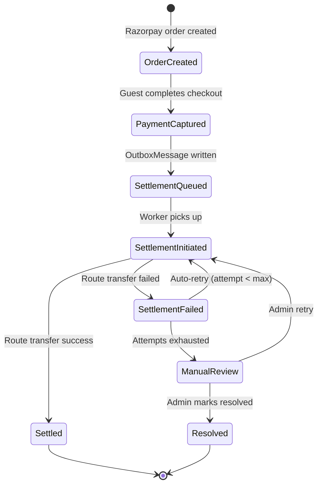

# RA-001: Requirements Addendum — Marketplace, Commission, Boost, OTA, Payments

**Addendum to:** [HLD](HLD-marketplace-commission-engine.md) | [LLD](LLD-marketplace-commission-engine.md)

**Purpose:** Fill every implementation gap so that a single developer, QA engineer, or support agent can build, test, and operate the marketplace + commission + OTA + payment features without ambiguity.

**Audience:** Developer, QA, Support

**Owner:** Atlas Tech Solutions

**Last updated:** 2026-02-27

**Status:** Draft

---

## Table of contents

1. [User Journeys and Screens](#1-user-journeys-and-screens)
2. [Business Rules](#2-business-rules)
3. [Ranking / Boost Specification V1](#3-ranking--boost-specification-v1)
4. [Payment and Ledger Specification V1](#4-payment-and-ledger-specification-v1)
5. [Integration Requirements](#5-integration-requirements)
6. [Observability, Support, and Ops](#6-observability-support-and-ops)
7. [Acceptance Criteria and Test Matrix](#7-acceptance-criteria-and-test-matrix)
8. [Rollout and Migration Addendum](#8-rollout-and-migration-addendum)

---

## 1. User journeys and screens

### Journey A: Tenant signup and profile creation

**Actors:** Prospective host

**Preconditions:** None (public page).

| Step | Screen / Action | Data fields | UI state | Validation | Error message | Audit event |
|------|----------------|-------------|----------|------------|---------------|-------------|
| A1 | Guest portal: click "Become a Host" | — | Opens `/become-a-host` | — | — | — |
| A2 | Fill registration form | `Name`, `Email`, `Phone`, `PropertyName`, `City` | All required, inline validation | Email: valid format. Phone: 10-digit Indian mobile or E.164. Name: 2-100 chars. | "Valid email required", "Phone must be 10 digits", "Name is required" | — |
| A3 | Submit | — | Spinner; disable button | Duplicate email check (across tenants) | "An account with this email already exists" | `tenant.registration.submitted` |
| A4 | Backend: create Tenant + TenantProfile + seed onboarding checklist | `Tenant.Slug` auto-generated from Name. `DefaultCommissionPercent = 1.00`. `PaymentMode = HOST_DIRECT`. `TenantProfile.OnboardingStatus = Draft`. | — | Slug uniqueness enforced (append numeric suffix if collision) | 409 if race condition | `tenant.created` |
| A5 | Redirect to admin portal `/onboarding` | — | Onboarding dashboard with checklist | — | — | `tenant.onboarding.started` |

**Success state:** Tenant exists, onboarding checklist seeded (profile, documents, property, listing, pricing steps). `DefaultCommissionPercent = 1.00`, `PaymentMode = HOST_DIRECT`.

**Acceptance criteria:**
- Given a new host submits valid registration, When backend processes, Then tenant + profile + onboarding items exist with correct defaults.
- Given duplicate email, When submitted, Then 409 with clear message; no partial records.

---

### Journey B: Tenant connects Airbnb (OAuth) through Channex

**Actors:** Tenant (authenticated in admin portal)

**Preconditions:** Tenant exists. At least one property created. Channex account exists (tenant may need to create one externally).

| Step | Screen / Action | Data fields | UI state | Validation | Error message | Audit event |
|------|----------------|-------------|----------|------------|---------------|-------------|
| B1 | Admin portal → Channel Manager (`/channels`) | — | List of properties with OTA connection status | — | — | — |
| B2 | Click "Connect Airbnb" next to target property | — | Opens Channex Airbnb connection page in **new tab** (URL: `https://app.channex.io/connect/airbnb?group_id={groupId}`) | — | — | `ota.airbnb.connect.initiated` |
| B3 | Tenant completes Airbnb OAuth on Channex (external) | Airbnb credentials, consent | Channex UI (out of Atlas scope) | — | If tenant closes tab: no state change in Atlas | — |
| B4 | Channex returns: API Key + External Property ID | — | Tenant copies values | — | — | — |
| B5 | Tenant returns to Atlas admin → Channel Manager | `apiKey`, `externalPropertyId` | Form: two text inputs pre-populated if Channex callback supported, else manual paste | apiKey: non-empty, max 500 chars. externalPropertyId: non-empty, max 200. | "API Key is required", "External Property ID is required" | — |
| B6 | Submit: `POST /api/channel-configs` | `{ propertyId, provider: "channex", apiKey, externalPropertyId }` | Spinner | PropertyId must belong to tenant. No duplicate (propertyId, provider) unless updating. | "Property not found", "Channel config already exists for this property" | `ota.channelconfig.created` |
| B7 | Click "Test Connection" | — | `POST /api/channel-configs/{id}/test` | — | If fail: "Connection failed: {error from Channex}". Show retry. | `ota.connection.tested` |
| B8 | Success state | — | Green badge: "Airbnb Connected". `LastSyncAt` displayed. "Disconnect" button visible. | — | — | `ota.airbnb.connected` |

**Error recovery:** If test fails, tenant can re-enter API key. If Channex account is suspended, error message from Channex is shown verbatim.

**Acceptance criteria:**
- Given valid Channex credentials, When test connection succeeds, Then `ChannelConfig.IsConnected = true` and `LastSyncAt` updated.
- Given invalid API key, When test connection fails, Then `IsConnected` remains false, error displayed, tenant can retry.

---

### Journey C: Tenant connects Booking.com (Hotel ID mapping) through Channex

**Actors:** Tenant (authenticated in admin portal)

**Preconditions:** Tenant exists. Property created. Booking.com extranet account exists.

| Step | Screen / Action | Data fields | UI state | Validation | Error message | Audit event |
|------|----------------|-------------|----------|------------|---------------|-------------|
| C1 | Admin portal → Channel Manager → property row | — | "Connect Booking.com" button | — | — | — |
| C2 | Click "Connect Booking.com" | — | Modal opens with instructions: "Enter your Booking.com Hotel ID from your extranet." | — | — | `ota.bookingcom.connect.initiated` |
| C3 | Enter Hotel ID | `externalPropertyId` (Booking.com hotel ID) | Text input | Non-empty. Numeric string (Booking.com uses numeric IDs). Max 50 chars. | "Hotel ID is required", "Hotel ID must be numeric" | — |
| C4 | Enter Channex API Key for this property/group | `apiKey` | Text input | Non-empty, max 500 | "API Key is required" | — |
| C5 | Submit: `POST /api/channel-configs` | `{ propertyId, provider: "channex", apiKey, externalPropertyId }` | Spinner | Same as Journey B step B6 | Same as B6 | `ota.channelconfig.created` |
| C6 | Test connection | — | Same as B7 | — | Same as B7 | `ota.connection.tested` |
| C7 | Success state | — | Green badge: "Booking.com Connected". Sync status displayed. | — | — | `ota.bookingcom.connected` |

**Key difference from Airbnb:** Booking.com does not use OAuth. Channex maps via Hotel ID. The flow is simpler — no external OAuth redirect. Tenant copies their Hotel ID from the Booking.com extranet and enters it alongside the Channex API key.

**Acceptance criteria:**
- Given valid Hotel ID and Channex API key, When test succeeds, Then Booking.com channel marked connected.
- Given non-numeric Hotel ID, When submitted, Then 400 validation error.

---

### Journey D: Tenant selects payment mode

**Actors:** Tenant (authenticated in admin portal)

**Preconditions:** Tenant exists.

#### D.1 HOST_DIRECT (default)

| Step | Screen / Action | Data fields | UI state | Validation | Error message | Audit event |
|------|----------------|-------------|----------|------------|---------------|-------------|
| D1.1 | Admin portal → Settings → Payment | — | Radio: HOST_DIRECT (selected), MARKETPLACE_SPLIT (disabled if no linked account) | — | — | — |
| D1.2 | If already HOST_DIRECT: show "Connect your Razorpay account to accept direct payments" with "Connect Razorpay" button | — | Button initiates OAuth to host's own Razorpay account | — | — | — |
| D1.3 | Razorpay OAuth flow (host's account) | Host approves on Razorpay | Popup/redirect to Razorpay consent | — | "Authorization failed. Please try again." | `payment.razorpay.host_direct.oauth.initiated` |
| D1.4 | Callback: store host's Razorpay keys | `RazorpayKeyId`, `RazorpayKeySecret` stored in existing `RazorpayConfig` pattern | Success toast: "Razorpay connected for direct payments" | — | — | `payment.razorpay.host_direct.connected` |

#### D.2 MARKETPLACE_SPLIT

| Step | Screen / Action | Data fields | UI state | Validation | Error message | Audit event |
|------|----------------|-------------|----------|------------|---------------|-------------|
| D2.1 | Settings → Payment → select MARKETPLACE_SPLIT | — | If no linked account: "You must connect Razorpay for split payments first" with "Connect for Marketplace" button | — | — | — |
| D2.2 | Click "Connect for Marketplace" | — | `POST /api/razorpay/oauth/authorize` → redirect to Razorpay OAuth | — | — | `payment.razorpay.marketplace.oauth.initiated` |
| D2.3 | Tenant approves on Razorpay | Consent screen | External Razorpay page | — | "Authorization denied" if user cancels | — |
| D2.4 | Callback: exchange code, create linked account, store encrypted tokens | `RazorpayLinkedAccountId`, `RazorpayAccessTokenEncrypted`, `RazorpayRefreshTokenEncrypted`, `RazorpayTokenExpiresAtUtc` | — | Token exchange must succeed; linked account creation must succeed | "Failed to create linked account. Please try again." (log full error) | `payment.razorpay.marketplace.linked_account.created` |
| D2.5 | Confirm mode switch | — | Warning modal: "Switching to Marketplace Split means Atlas will collect payments and transfer your share minus commission. Future bookings only. Continue?" | — | — | — |
| D2.6 | Save | `PaymentMode = 'MARKETPLACE_SPLIT'` | Success toast. Radio updates. | `RazorpayLinkedAccountId` must be non-null | "Razorpay not connected" | `tenant.payment_mode.changed` with `{ old: HOST_DIRECT, new: MARKETPLACE_SPLIT }` |

**Switching back to HOST_DIRECT:**

| Step | Action | Validation | Audit |
|------|--------|------------|-------|
| Select HOST_DIRECT | Warning: "In-flight bookings with MARKETPLACE_SPLIT will still settle via split. Only future bookings change." | Always allowed (no pending-booking gate needed — snapshot protects in-flight) | `tenant.payment_mode.changed` with `{ old: MARKETPLACE_SPLIT, new: HOST_DIRECT }` |

**Acceptance criteria:**
- Given tenant with linked account, When MARKETPLACE_SPLIT selected and saved, Then `Tenant.PaymentMode = MARKETPLACE_SPLIT`.
- Given tenant without linked account, When MARKETPLACE_SPLIT selected, Then save button disabled; prompt to connect Razorpay.
- Given mode switch, When saved, Then existing bookings with snapshotted mode are unaffected.

---

### Journey E: Tenant sets default commission

**Actors:** Tenant (authenticated in admin portal)

**Preconditions:** Tenant exists.

| Step | Screen / Action | Data fields | UI state | Validation | Error message | Audit event |
|------|----------------|-------------|----------|------------|---------------|-------------|
| E1 | Admin portal → Settings → Commission | — | Number input showing current `DefaultCommissionPercent` | — | — | — |
| E2 | Change value | `defaultCommissionPercent` | Live preview: "Atlas commission: X%. On a INR 10,000 booking: Atlas earns INR Y, you receive INR Z." | Min: 1.00, Max: 20.00, Step: 0.01. Must be numeric. | "Commission must be between 1% and 20%", "Invalid number" | — |
| E3 | Click Save | — | Warning modal (see below) | Backend re-validates >= 1.00, <= 20.00 | 400: "Commission must be at least 1%" / "Commission cannot exceed 20%" | — |
| E4 | Confirm in modal | — | "Changing from X% to Y% affects future bookings only. Properties with overrides below Y% will be auto-adjusted." | — | — | `tenant.commission.changed` with `{ old, new, propertiesAffected: count }` |
| E5 | Backend: update tenant + cascade | Update `Tenant.DefaultCommissionPercent`. For each property where `CommissionPercent < new default`: set `CommissionPercent = NULL` (revert to default). | Success toast | — | — | Per-property cascade logged as `property.commission.auto_adjusted` |

**Acceptance criteria:**
- Given new commission = 3%, existing property override = 2%, When saved, Then property override set to NULL (falls back to 3%).
- Given new commission = 3%, existing property override = 5%, When saved, Then property override unchanged (5% >= 3%).
- Given value 0.5%, When submitted, Then 400 error.

---

### Journey F: Property onboarding

**Actors:** Tenant (authenticated in admin portal)

**Preconditions:** Tenant exists.

#### F.1 Create property

| Step | Screen / Action | Data fields | UI state | Validation | Error message |
|------|----------------|-------------|----------|------------|---------------|
| F1.1 | Admin → Properties → Add | `Name`, `Address`, `Type`, `OwnerName`, `ContactPhone`, `Status`, `CommissionPercent` (optional) | Form with defaults. Commission field label: "Commission Override (optional)" | Name: required, 2-200 chars. Address: required. Type: required (dropdown). Phone: required, valid. CommissionPercent: if set, >= tenant default. | Standard field-level errors |
| F1.2 | Submit | — | `POST /properties` | All above + propertyId auto-assigned | 400 on validation failure | 
| F1.3 | Success | — | Property appears in table. `IsMarketplaceEnabled = false` by default. | — | — |

**Audit:** `property.created` with `{ propertyId, tenantId, commissionPercent }`.

#### F.2 Marketplace visibility

| Step | Screen / Action | Data fields | UI state | Validation | Error message |
|------|----------------|-------------|----------|------------|---------------|
| F2.1 | Property row → edit → Marketplace section | `IsMarketplaceEnabled` toggle | Off by default. Disabled if `Property.Status != 'Active'`. | Property must be Active. Must have at least one active listing with pricing. | "Property must be Active", "Add at least one listing with pricing first" |
| F2.2 | Toggle on | — | Info: "This property will appear on atlashomestays.com marketplace." If `PaymentMode = MARKETPLACE_SPLIT`: "Bookings from marketplace will use split settlement." If `HOST_DIRECT`: "Bookings from marketplace will go directly to your Razorpay." | — | — |
| F2.3 | Save | `PUT /properties/{id}/marketplace` | Success toast | — | — |

**Audit:** `property.marketplace.toggled` with `{ propertyId, enabled: true/false }`.

#### F.3 Set / clear commission override

| Step | Screen / Action | Data fields | UI state | Validation | Error message |
|------|----------------|-------------|----------|------------|---------------|
| F3.1 | Property edit → Commission section | Slider + numeric input. Range: tenant default to 20%. "Clear" button to revert to default. | Shows: "Tenant default: X%. Current override: Y%. Effective: Y%." | If set: >= tenant default, <= 20.00. | "Override must be at least {tenantDefault}%", "Override cannot exceed 20%" |
| F3.2 | Adjust slider | — | Live update: "Estimated boost: Low / Medium / High" (computed from log formula, displayed as a qualitative band). "On a INR 10,000 booking: Atlas earns INR Y." | — | — |
| F3.3 | Save | `PUT /properties/{id}/commission` | Warning modal: "This affects future bookings from this property only." | — | — |
| F3.4 | Clear override | `PUT /properties/{id}/commission` with `{ commissionPercent: null }` | "Commission reverted to tenant default (X%)." | — | — |

**Boost impact estimate (displayed to tenant):**

| Override % | Qualitative label | Tooltip |
|:----------:|:-----------------:|---------|
| = tenant default | No boost | "Your property ranks using standard quality signals." |
| tenant default + 1-2pp | Low boost | "Slight improvement in marketplace ranking." |
| tenant default + 3-5pp | Medium boost | "Moderate improvement in marketplace ranking." |
| tenant default + 6-9pp | High boost | "Strong improvement. Diminishing returns above this level." |
| >= tenant default + 10pp | Maximum boost | "Maximum ranking benefit reached." |

**Audit:** `property.commission.changed` with `{ propertyId, old, new, effectiveRate }`.

**Acceptance criteria:**
- Given tenant default 1%, property override 5%, When saved, Then effective rate = 5%.
- Given tenant default 3%, property override 2%, When saved, Then 400 error.
- Given property override cleared, When saved, Then effective rate = tenant default.

---

### Journey G: Guest journey

**Actors:** Guest (unauthenticated)

| Step | Screen / Route | Data | UI state | Validation | Error | Audit |
|------|---------------|------|----------|------------|-------|-------|
| G1 | `atlashomestays.com/` | — | Marketplace homepage: search bar (location, dates, guests), featured properties | — | — | — |
| G2 | `atlashomestays.com/search?location=Goa&checkIn=...&checkOut=...&guests=2` | Query params | Ranked property cards. Default sort: Recommended. Cards show: photo, name, location, price/night, rating, "Featured" badge if boosted. **No commission info shown to guest.** | Dates: checkIn < checkOut, both future. Guests: >= 1. | "Check-in must be before check-out" | — |
| G3 | Click property card → `atlashomestays.com/{property-slug}` | — | Property detail: photos, description, amenities, reviews, availability calendar, price breakdown, "Book Now" CTA. | — | — | `marketplace.property.viewed` |
| G4 | Select dates + guests → click "Book Now" | `checkIn`, `checkOut`, `guests` | Booking summary: nightly rate x nights, taxes/fees, **total** (no commission line). Guest name, phone, email form. | Availability check (real-time). Guest fields required. | "Dates not available", "Guest name required" | — |
| G5 | Click "Pay" | — | Creates booking draft + Razorpay order. Opens Razorpay Checkout modal. If `HOST_DIRECT`: Razorpay shows host's brand. If `MARKETPLACE_SPLIT`: shows Atlas brand. | Amount matches. | "Payment failed. Please try again." | `booking.payment.initiated` |
| G6 | Complete payment | Razorpay paymentId, signature | Verify → Confirmed | Signature HMAC verification | "Payment verification failed" | `booking.confirmed` |
| G7 | Confirmation page | Booking reference, dates, property, amount | "Booking Confirmed!" + booking reference. Confirmation email/WhatsApp sent via notification pipeline. | — | — | `booking.confirmation.sent` |

**Commission-neutral pricing:** The guest sees `FinalAmount`. Internally: `CommissionAmount = FinalAmount * rate / 100`, `HostPayoutAmount = FinalAmount - CommissionAmount`. Guest is never shown these splits.

**Acceptance criteria:**
- Given marketplace property with 5% commission, priced at INR 10,000/night for 2 nights, When guest books, Then guest pays INR 20,000 total (+ taxes/fees). Commission is internal.
- Given HOST_DIRECT property, When guest pays, Then Razorpay checkout uses host's keys.
- Given MARKETPLACE_SPLIT property, When guest pays, Then Razorpay checkout uses Atlas keys; settlement is async.

---

### Journey H: Admin journey

**Actors:** Atlas Admin (platform operator)

| Step | Screen / Route | Data | Purpose |
|------|---------------|------|---------|
| H1 | Platform admin → Tenants list | All tenants: Name, Slug, Plan, PaymentMode, DefaultCommission, IsActive, LinkedAccountId (yes/no) | Overview of all tenants |
| H2 | Tenant detail → Commission tab | DefaultCommissionPercent, PaymentMode, linked account status, token expiry | Diagnose tenant payment issues |
| H3 | Tenant detail → Properties tab | List with: Name, CommissionPercent (override or "default"), IsMarketplaceEnabled, Status, OTA connections | Property-level oversight |
| H4 | Tenant detail → Bookings tab | List with: BookingId, Amount, CommissionPercentSnapshot, CommissionAmount, HostPayoutAmount, PaymentModeSnapshot, SettlementStatus | Financial audit trail |
| H5 | Settlement dashboard | Bookings with `PaymentModeSnapshot = MARKETPLACE_SPLIT`: SettlementStatus (Pending/Settled/Failed), TransferId, Attempts | Monitor settlement health |
| H6 | Failed settlements → Manual resolution | Select failed settlement → "Retry" or "Mark Resolved" with notes | Resolve stuck settlements |
| H7 | Commission override audit | Read-only log: who changed what, when | Dispute resolution |

**Manual override rules:**
- Admin can **retry** a failed settlement (resets attempt count, re-queues outbox).
- Admin can **mark resolved** (with mandatory notes) if settled out-of-band.
- Admin **cannot** change `CommissionPercentSnapshot` on a booking (immutable).
- Admin **can** adjust `Tenant.DefaultCommissionPercent` (same validation as tenant; affects future bookings only).

**Acceptance criteria:**
- Given a failed settlement, When admin clicks Retry, Then outbox re-queued with attempt = 0.
- Given admin views booking, Then CommissionPercentSnapshot and PaymentModeSnapshot are read-only.

---

## 2. Business rules

### Commission

- **BR-C01:** The system MUST enforce `Tenant.DefaultCommissionPercent >= 1.00` on every write.
- **BR-C02:** The system MUST enforce `Tenant.DefaultCommissionPercent <= 20.00` (cap).
- **BR-C03:** `Property.CommissionPercent`, when non-null, MUST be `>= Tenant.DefaultCommissionPercent`.
- **BR-C04:** `Property.CommissionPercent`, when non-null, MUST be `<= 20.00`.
- **BR-C05:** The effective commission rate MUST be resolved as: `MAX(1.00, Property.CommissionPercent ?? Tenant.DefaultCommissionPercent ?? 1.00)`.
- **BR-C06:** `Booking.CommissionPercentSnapshot` MUST be set at booking creation and MUST NOT be modified after.
- **BR-C07:** `Booking.CommissionAmount` MUST equal `ROUND(FinalAmount * CommissionPercentSnapshot / 100, 2)`.
- **BR-C08:** `Booking.HostPayoutAmount` MUST equal `FinalAmount - CommissionAmount`.
- **BR-C09:** When `Tenant.DefaultCommissionPercent` is raised, properties with overrides below the new default MUST have their override set to NULL (revert to default).
- **BR-C10:** When `Tenant.DefaultCommissionPercent` is lowered, existing property overrides MUST NOT be auto-lowered (they remain as-is).

### Payment mode

- **BR-P01:** `Tenant.PaymentMode` MUST be one of `HOST_DIRECT` or `MARKETPLACE_SPLIT`.
- **BR-P02:** Switching payment mode MUST be allowed at any time (no pending-booking gate). Snapshot invariant protects in-flight bookings.
- **BR-P03:** `Booking.PaymentModeSnapshot` MUST be set at booking creation (specifically at Razorpay order creation) and MUST NOT be modified after.
- **BR-P04:** If `PaymentMode = MARKETPLACE_SPLIT` and `RazorpayLinkedAccountId` is null at booking time, the system MUST reject the booking with HTTP 400.
- **BR-P05:** On mode switch, the system SHOULD display a warning that only future bookings are affected.

### Marketplace visibility

- **BR-M01:** `Property.IsMarketplaceEnabled` MUST default to `false` for new properties.
- **BR-M02:** A property MUST NOT appear on the marketplace unless ALL of: `IsMarketplaceEnabled = true`, `Status = 'Active'`, tenant subscription active, at least one active listing with pricing.
- **BR-M03:** If a property's status changes to non-Active, the system SHOULD hide it from marketplace results immediately (query-time filter; no async delay).
- **BR-M04:** Draft or disabled properties MUST NOT appear on the marketplace under any circumstances.

### Refunds and cancellations

- **BR-R01:** On full refund (`HOST_DIRECT`): existing `RefundPaymentAsync` flow applies. No commission reversal needed (commission was reporting-only).
- **BR-R02:** On full refund (`MARKETPLACE_SPLIT`): Atlas MUST initiate a Razorpay refund from Atlas's account to guest. The settlement transfer to host MUST be reversed (Razorpay Route reversal or manual deduction from next settlement). `CommissionAmount` is zeroed in the refund ledger entry.
- **BR-R03:** On partial refund (`MARKETPLACE_SPLIT`): refund the guest the partial amount from Atlas's account. Recompute: `RefundedCommission = RefundAmount * CommissionPercentSnapshot / 100`. `RefundedHostShare = RefundAmount - RefundedCommission`. Reverse `RefundedHostShare` from host's settlement.
- **BR-R04:** The system MUST record all refund amounts, commission reversals, and host deductions in the ledger (see section 4).
- **BR-R05:** Refund MUST NOT change `CommissionPercentSnapshot` (immutable).

### Dispute handling (v1 minimal)

- **BR-D01:** Disputes are handled manually by Atlas Admin via the settlement dashboard.
- **BR-D02:** The system MUST provide read-only access to booking details, commission snapshots, settlement status, and audit logs for dispute resolution.
- **BR-D03:** Atlas Admin MAY mark a settlement as "Resolved" with mandatory notes.
- **BR-D04:** Automated dispute workflows MAY be introduced in a later version.

### Tax handling (high level)

- **BR-T01:** Atlas is responsible for invoicing commission (as a service fee) to the tenant. GST on commission is Atlas's responsibility.
- **BR-T02:** The tenant is responsible for invoicing the guest for the accommodation charge. GST on accommodation is the tenant's responsibility.
- **BR-T03:** The system MUST record `CommissionAmount` and `HostPayoutAmount` as separate ledger entries for tax reporting.
- **BR-T04:** `BookingInvoice` (existing model) SHOULD include a commission line item for `MARKETPLACE_SPLIT` bookings.
- **BR-T05:** The system MUST NOT provide tax advice. Tax rate configuration is the tenant's responsibility.

---

## 3. Ranking / Boost specification V1

### 3.1 Exact ranking formula V1

```
RankingScore = (0.30 * BaseQuality)
             + (0.25 * CommissionBoost)
             + (0.25 * ReviewScore)
             + (0.20 * RecencyScore)
```

All component scores are normalized to [0.0, 1.0].

### 3.2 Component definitions

**BaseQuality (0-1):**

| Signal | Weight within component | Computation |
|--------|:----------------------:|-------------|
| Has photos | 0.30 | 1.0 if listing has >= 1 photo, else 0.0 |
| Has description | 0.20 | 1.0 if listing description > 50 chars, else 0.0 |
| Has pricing | 0.30 | 1.0 if listing has `BaseNightlyRate > 0`, else 0.0 |
| Has amenities | 0.20 | 1.0 if listing has >= 3 amenity tags, else 0.0 |

`BaseQuality = sum of (signal * weight)`

**CommissionBoost (0-1):**

```
CommissionBoost = log(1 + EffectiveCommissionPercent) / log(1 + MaxCap)
```

- `MaxCap = 20` (configurable constant `RankingConstants.MaxCommissionCap`).
- At 1%: 0.228. At 5%: 0.589. At 10%: 0.787. At 20%: 1.000.
- Applied only if property passes minimum quality threshold (see 3.4).

**ReviewScore (0-1):**

```
ReviewScore = avg(Review.Rating) / 5.0
```

- If property has zero reviews: `ReviewScore = 0.0`.
- Minimum 1 review for score to be > 0.

**RecencyScore (0-1):**

```
If daysSinceLastBooking <= 7:  RecencyScore = 1.0
If daysSinceLastBooking >= 90: RecencyScore = 0.0
Else: RecencyScore = 1.0 - (daysSinceLastBooking - 7) / (90 - 7)
```

Linear decay from 1.0 at 7 days to 0.0 at 90 days. Properties with no bookings: `RecencyScore = 0.0`.

### 3.3 Tie-breakers

When two properties have identical `RankingScore` (within epsilon 0.001):

1. Higher `ReviewScore` wins.
2. If still tied: more recent `CreatedAtUtc` wins (newer property).
3. If still tied: alphabetical by `Property.Name`.

### 3.4 Anti-gaming guardrails

**Minimum quality threshold:**

- Commission boost MUST only apply if `BaseQuality >= 0.50`.
- Properties below this threshold: `CommissionBoost = 0.0` regardless of commission.
- Rationale: prevents empty/stub listings from paying their way to the top.

**Cooldown on commission changes:**

- After a tenant or property commission change, the new commission value takes effect in the ranking engine **after a 1-hour delay** (cached score TTL).
- Rationale: prevents rapid commission gaming (raise before peak hours, lower after).
- Implementation: ranking cache TTL = 15 minutes; commission change timestamp tracked; ranking engine ignores changes < 60 minutes old for boost calculation (uses previous value).

**Weight cap:**

- `w_commission` MUST NOT exceed 0.30 (30% of total score). Current default: 0.25.
- Configurable via `RankingConstants.MaxCommissionWeight`.

**Anomaly detection (future, not v1):**

- Monitor for tenants rapidly oscillating commission. Flag for review if > 5 changes in 24 hours.
- Not enforced in v1; documented for v2 consideration.

### 3.5 Explainability

**What the tenant sees (admin portal):**

- "Boost Level: Low / Medium / High / Maximum" (qualitative band from section 1, Journey F3).
- "Estimated Ranking Impact: Your property may appear approximately X% higher in search results compared to no boost." Computed as: `CommissionBoost * w_commission * 100 / 1.0`%. Displayed as "~Y% ranking improvement".
- Caveat text: "Actual ranking depends on reviews, listing quality, and booking recency."

**What the guest sees (guest portal):**

- Properties with boost show a subtle "Featured" pill badge. No text about commission or sponsorship.
- No ranking score, commission percentage, or boost level is exposed to the guest.
- Sort options: "Recommended", "Price: Low to High", "Price: High to Low", "Rating", "Newest".
- "Recommended" is the default sort using `RankingScore`.

---

## 4. Payment and ledger specification V1

### 4.1 Ledger entities

| Entity | Table | Purpose |
|--------|-------|---------|
| **BookingCharge** | `Bookings` (existing) | The guest-facing charge: `FinalAmount`, `CommissionPercentSnapshot`, `CommissionAmount`, `HostPayoutAmount`, `PaymentModeSnapshot` |
| **CommissionLedger** | `Payments` (extend) + structured logs | Atlas's commission income per booking. Recorded as a structured log entry (see 4.6). Physical ledger table is a v2 enhancement. |
| **HostPayoutLedger** | `Payments` (extend) + `OutboxMessage` for settlement tracking | Host's payout per booking. Settlement status tracked via outbox + payment row. |
| **RefundLedger** | `Payments` (existing refund rows) | Refund amounts, commission reversals. Negative payment rows with `Type = 'refund'`. |

**V1 simplification:** Rather than introducing four new tables, v1 uses existing `Bookings` and `Payments` tables with new columns, plus structured log entries for the commission and payout ledger. A dedicated ledger table (`CommissionLedgerEntry`) is a v2 enhancement if reconciliation reporting requires it.

### 4.2 Required booking snapshots

Every booking MUST capture these at creation time (never modified after):

| Field | Source | Written when |
|-------|--------|-------------|
| `CommissionPercentSnapshot` | `CommissionCalculationService.ResolveCommission()` | Booking creation / Razorpay order creation |
| `CommissionAmount` | `ROUND(FinalAmount * snapshot / 100, 2)` | Same |
| `HostPayoutAmount` | `FinalAmount - CommissionAmount` | Same |
| `PaymentModeSnapshot` | `Tenant.PaymentMode` at that instant | Same |

### 4.3 Idempotency keys

| Action | Idempotency key format | Scope |
|--------|----------------------|-------|
| Create Razorpay order | `order:{TenantId}:{BookingId}` | Prevents duplicate orders for same booking |
| Verify payment | `verify:{RazorpayPaymentId}` | Existing in `RazorpayPaymentService` |
| Settlement transfer | `settlement:{BookingId}:{PaymentId}` | Prevents duplicate Route transfers |
| Refund | `refund:{BookingId}:{Amount}:{Reason hash}` | Prevents duplicate refunds |
| Settlement retry | `settlement:{BookingId}:{PaymentId}` (same key) | Idempotent retry safe |

### 4.4 Split settlement flow states (MARKETPLACE_SPLIT)



**States on Payment row:**

| State | `Payment.Status` | `Settlement*` fields |
|-------|------------------|--------------------|
| Order created | `pending` | — |
| Payment captured | `completed` | — |
| Settlement queued | `completed` | `SettlementStatus = 'Queued'` (new field, or tracked via OutboxMessage.Status) |
| Settlement initiated | `completed` | `SettlementStatus = 'Initiated'` |
| Settled | `completed` | `SettlementStatus = 'Settled'`, `SettlementTransferId = 'trf_xxx'` |
| Failed | `completed` | `SettlementStatus = 'Failed'`, `SettlementLastError` |
| Resolved | `completed` | `SettlementStatus = 'Resolved'`, `SettlementResolvedNotes` |

**Optional new columns on Payments (v1):** `SettlementStatus` (varchar 20), `SettlementTransferId` (varchar 100), `SettlementAttemptCount` (int), `SettlementLastError` (text), `SettlementResolvedBy` (int, userId), `SettlementResolvedNotes` (text). Alternatively, track entirely via OutboxMessage status and structured logs.

### 4.5 Host-direct flow states

```
[*] → OrderCreated → PaymentCaptured → [*]
```

No settlement phase. `Booking.PaymentModeSnapshot = HOST_DIRECT`. Payment goes directly to host's Razorpay account. Commission fields are populated for reporting only.

### 4.6 Reconciliation reports (minimum required)

| Report | Audience | Data |
|--------|----------|------|
| **Settlement status** | Atlas Admin | All `MARKETPLACE_SPLIT` bookings: BookingId, Amount, CommissionAmount, HostPayout, SettlementStatus, TransferId, Attempts |
| **Commission summary (period)** | Atlas Admin | Total commission earned per period (day/week/month), grouped by tenant |
| **Host payout summary** | Tenant (admin portal) | Per-booking: Amount, Commission %, Commission Amount, Your Payout, Settlement Status |
| **Failed settlements** | Atlas Admin | Bookings where `SettlementStatus = Failed` or `ManualReview`, with LastError and attempt count |

### 4.7 Failure handling and retries

| Failure | Auto-retry? | Max attempts | Backoff | Escalation |
|---------|:-----------:|:------------:|---------|------------|
| Razorpay Route 5xx | Yes | 5 | Exponential: 1m, 2m, 4m, 8m, 16m | After 5: mark `Failed`, alert Atlas Admin |
| Razorpay Route 4xx (invalid account) | No | 1 | — | Immediate `Failed`, alert Atlas Admin, notify tenant |
| Razorpay Route 429 (rate limit) | Yes | 5 | Respect `Retry-After` header, minimum 60s | Same as 5xx |
| Network timeout | Yes | 5 | Exponential | Same as 5xx |
| OAuth token expired during settlement | Yes (refresh first) | 2 (1 refresh + 1 retry) | Immediate refresh, then retry | If refresh fails: `Failed`, disable MARKETPLACE_SPLIT for tenant, notify |

**Rule:** The guest's booking is NEVER rolled back due to settlement failure. The guest's payment is captured and confirmed. Settlement failure is an Atlas-host financial matter resolved separately.

---

## 5. Integration requirements

### 5.A Channex

#### Configuration per tenant

| Config item | Storage | Required |
|-------------|---------|:--------:|
| Channex API Key | `ChannelConfig.ApiKey` (per property) | Yes |
| External Property ID | `ChannelConfig.ExternalPropertyId` | Yes |
| Provider | `ChannelConfig.Provider` (always `"channex"`) | Yes |
| Group ID (for Airbnb OAuth redirect URL) | Derived from Channex account, entered by tenant | For Airbnb |

#### Token storage

- Channex uses **API keys**, not OAuth tokens. Stored in `ChannelConfig.ApiKey` (varchar 500).
- Keys are stored as plaintext in v1 (same as current implementation). **v2 enhancement:** encrypt at rest via Data Protection API.
- Keys are scoped per property, not per tenant.

#### Webhook requirements

- **V1:** No Channex webhooks. Atlas pushes to Channex (rates, availability). Atlas does not receive booking notifications from Channex.
- **V2 consideration:** Channex can push booking notifications via webhook. Requires: webhook endpoint, signature verification, mapping to Atlas bookings.

#### Sync health and monitoring

| Metric | Source | Alert threshold |
|--------|--------|-----------------|
| `LastSyncAt` age | `ChannelConfig.LastSyncAt` | > 2 hours since last successful sync |
| `LastSyncError` non-null | `ChannelConfig.LastSyncError` | Any non-null error persisting > 1 hour |
| Sync attempt failures | Structured log `ota.sync.failed` | > 3 consecutive failures |

#### Onboarding SOP per property

| Step | Effort | Who |
|------|--------|-----|
| 1. Tenant creates Channex account | 5 min | Tenant |
| 2. Tenant connects Airbnb/Booking.com in Channex | 10-15 min | Tenant |
| 3. Tenant enters API key + property ID in Atlas | 2 min | Tenant |
| 4. Test connection | 1 min | Tenant (click) |
| 5. Initial rate/availability push | Automatic | System |
| **Total human effort** | **~20 min per property** | |

#### Rate limits and backoff (assumptions)

- Channex API rate limit: **assumed 60 requests/minute per API key** (not officially documented; treat as conservative estimate).
- Backoff: if 429 received, wait `Retry-After` header value (or 60s default). Max 3 retries per sync cycle.
- Sync interval: every 15 minutes (existing `ICalSyncHostedService` pattern).
- Batch: push all rate changes since last sync in one call per property.

### 5.B Razorpay

#### OAuth onboarding requirements

| Requirement | Detail |
|-------------|--------|
| Razorpay Partner account | Atlas must have a Razorpay Partner / Route-enabled account |
| OAuth client credentials | `client_id` and `client_secret` from Razorpay Partner dashboard |
| Redirect URI | `https://atlas-api.azurewebsites.net/api/razorpay/oauth/callback` (must be registered in Razorpay) |
| Scopes | `read_write` (for account management and payment transfers) |

#### Route linked account onboarding

| Requirement | Detail |
|-------------|--------|
| Tenant KYC | Razorpay requires linked account KYC. Minimum: email + phone + business name. Full activation may require PAN, bank details. |
| KYC status states | `created` → `needs_clarification` → `under_review` → `activated` → `suspended` |
| What UI shows per state | See table below |

**KYC status → UI mapping:**

| Razorpay status | Admin portal display | Can accept MARKETPLACE_SPLIT bookings? |
|----------------|---------------------|:--------------------------------------:|
| `created` | "Account created. KYC pending." | No |
| `needs_clarification` | "Razorpay needs additional documents. Check your Razorpay dashboard." | No |
| `under_review` | "KYC under review by Razorpay. This usually takes 2-3 business days." | No |
| `activated` | "Razorpay account active. Ready for marketplace payments." (green) | Yes |
| `suspended` | "Razorpay account suspended. Contact Razorpay support." (red) | No |

**Rule:** Only `activated` linked accounts can receive settlement transfers. If status is anything else, system MUST block new `MARKETPLACE_SPLIT` bookings for that tenant.

#### Webhook verification requirements

| Webhook | Required signature | Action |
|---------|-------------------|--------|
| `payment.captured` | HMAC-SHA256 with `WebhookSecret` | Reconcile payments (existing flow in `RazorpayController`) |
| `transfer.settled` | HMAC-SHA256 with `WebhookSecret` | Update `SettlementStatus = 'Settled'` on Payment row |
| `transfer.failed` | HMAC-SHA256 with `WebhookSecret` | Update `SettlementStatus = 'Failed'`, trigger alert |
| `account.suspended` | HMAC-SHA256 with `WebhookSecret` | Block MARKETPLACE_SPLIT for tenant, notify |

**V1 implementation:** At minimum, implement `payment.captured` (already exists). `transfer.settled` and `transfer.failed` are recommended for v1 to avoid polling. Others can be v2.

#### Token storage, encryption, rotation

| Token | Storage | Encryption | Rotation |
|-------|---------|------------|----------|
| Access token | `Tenant.RazorpayAccessTokenEncrypted` | AES-256 via `IDataProtector`, purpose: `"RazorpayOAuthTokens"` | Refresh before expiry (background job, daily check) |
| Refresh token | `Tenant.RazorpayRefreshTokenEncrypted` | Same | Rotated on each refresh (Razorpay issues new refresh token) |
| Webhook secret | `appsettings.json` or Azure Key Vault | Not in DB | Manual rotation via config deploy |
| Atlas master KeyId/Secret | `appsettings.json` or Azure Key Vault | Not in DB | Manual rotation via config deploy |

**Key rotation policy:**
- Access tokens: auto-refreshed. No manual action.
- Refresh tokens: auto-rotated on each refresh call. If refresh fails, tenant must re-authorize (Journey D2).
- Webhook secrets: rotate quarterly (manual config deploy).
- Master keys: rotate annually or on suspected compromise.

---

## 6. Observability, support, and ops

### 6.1 Operational dashboards

| Dashboard | Metrics | Source |
|-----------|---------|--------|
| **Marketplace health** | Active marketplace properties, daily search requests, booking conversion rate | Structured logs + DB queries |
| **Commission overview** | Total commission earned (today/week/month), avg commission %, top tenants by commission | `Bookings` table aggregation |
| **Settlement pipeline** | Queued / Initiated / Settled / Failed counts, avg settlement latency, retry rate | `OutboxMessage` + `Payments` |
| **OTA sync health** | Connected properties, last sync age, failure rate per provider | `ChannelConfig` + structured logs |
| **Razorpay OAuth health** | Tenants with linked accounts, token expiry within 24h, failed refreshes | `Tenants` table query |

### 6.2 Alerts

| Alert | Trigger | Severity | Action |
|-------|---------|----------|--------|
| Settlement failure rate > 10% | > 10% of settlements in last hour failed | Critical | Page Atlas Admin. Check Razorpay status page. |
| Settlement queue depth > 50 | More than 50 pending settlements | Warning | Check worker health, DB locks |
| Razorpay token expiry within 24h | Any tenant's `RazorpayTokenExpiresAtUtc < now + 24h` AND refresh not yet succeeded | Warning | Auto-refresh should handle; alert if it hasn't |
| OTA sync failure > 3 consecutive | `ChannelConfig` with 3+ consecutive sync errors | Warning | Check Channex API status, API key validity |
| Commission calculation error | Any uncaught exception in `CommissionCalculationService` | Critical | Booking creation will fail; investigate immediately |
| Marketplace search latency > 2s (p95) | Performance monitoring | Warning | Check ranking cache, DB query plan |

### 6.3 Support playbooks (top 10 incidents)

| # | Incident | Playbook |
|---|---------|----------|
| 1 | **Guest says "payment taken but no confirmation"** | Check `Payments` for `RazorpayPaymentId`. If `Status = completed` and `Booking.BookingStatus = Confirmed`: resend confirmation. If `Status = pending`: check Razorpay dashboard for actual capture status; reconcile. |
| 2 | **Host says "I didn't receive my payout"** | Check `Booking.PaymentModeSnapshot`. If `MARKETPLACE_SPLIT`: check settlement status. If `Settled`: provide transfer ID, tell host to check Razorpay. If `Failed`: see #3. If `HOST_DIRECT`: Atlas doesn't handle payouts; direct to host's Razorpay. |
| 3 | **Settlement failed after max retries** | Check `SettlementLastError`. If 4xx (invalid account): verify linked account status in Razorpay. If account suspended: notify host. If 5xx: manual retry via admin dashboard. |
| 4 | **Tenant can't switch to MARKETPLACE_SPLIT** | Check `RazorpayLinkedAccountId`. If null: tenant hasn't completed OAuth. If set but status ≠ activated: KYC incomplete. Direct tenant to Razorpay dashboard. |
| 5 | **Commission shows 0 on booking** | Check `CommissionPercentSnapshot`. If null: legacy booking. If 0: should not happen (floor is 1%). Check `Tenant.DefaultCommissionPercent` and `Property.CommissionPercent`. |
| 6 | **OTA rates not syncing** | Check `ChannelConfig.LastSyncError`. Test connection via API. Verify API key validity. Check Channex status page. |
| 7 | **Property not showing on marketplace** | Check: `IsMarketplaceEnabled = true`? `Status = Active`? Tenant subscription active? Listing with pricing exists? Feature flag `marketplace.enabled` on? |
| 8 | **Tenant says commission changed retroactively** | Pull audit log for `tenant.commission.changed`. Verify `CommissionPercentSnapshot` on disputed booking matches the rate at booking time. Commission NEVER changes retroactively. |
| 9 | **Razorpay OAuth callback fails** | Check API logs for callback URL. Verify redirect URI matches Razorpay config. Check for `state` parameter mismatch (CSRF). Check Razorpay Partner dashboard for app config. |
| 10 | **Guest refund on MARKETPLACE_SPLIT booking** | Process refund from Atlas's Razorpay account. Log commission reversal. Reverse/deduct host settlement (if already settled, deduct from next settlement or manual clawback). |

### 6.4 Audit log schema

Every auditable action produces a structured log entry AND (for financial events) a DB record.

**Structured log fields (all events):**

```json
{
  "timestamp": "ISO-8601",
  "event": "event.name",
  "tenantId": 42,
  "userId": 7,
  "entityType": "Tenant|Property|Booking|Payment",
  "entityId": "123",
  "action": "created|updated|deleted",
  "changes": { "field": { "old": "X", "new": "Y" } },
  "correlationId": "uuid",
  "ipAddress": "masked"
}
```

**Audited events:**

| Event | Entity | Fields logged |
|-------|--------|---------------|
| `tenant.commission.changed` | Tenant | old/new `DefaultCommissionPercent`, affected property count |
| `tenant.payment_mode.changed` | Tenant | old/new `PaymentMode` |
| `property.commission.changed` | Property | old/new `CommissionPercent`, effective rate |
| `property.commission.auto_adjusted` | Property | reason (tenant default raised), old/new |
| `property.marketplace.toggled` | Property | enabled: true/false |
| `booking.commission.snapshotted` | Booking | `CommissionPercentSnapshot`, `CommissionAmount`, `HostPayoutAmount`, `PaymentModeSnapshot` |
| `settlement.attempted` | Payment | amount, linkedAccountId, attempt #, status |
| `settlement.resolved` | Payment | resolvedBy userId, notes |
| `payment.razorpay.*.oauth.*` | Tenant | initiated/connected/failed/disconnected |
| `ota.channelconfig.*` | ChannelConfig | created/tested/connected/disconnected |

### 6.5 Debug bundle (tenant self-service)

Tenants can download a "debug bundle" (JSON) from the admin portal containing:

- Tenant settings: commission, payment mode, linked account status (ID only, no tokens).
- Properties: list with commission overrides, marketplace status, OTA connection status.
- Recent bookings (last 30): commission snapshots, payment modes, settlement statuses.
- Recent sync attempts (last 24h): success/fail, errors.

**Excludes:** OAuth tokens, API keys, guest PII beyond booking IDs, internal Atlas Admin actions.

---

## 7. Acceptance criteria and test matrix

### 7.1 Feature-level acceptance criteria

#### Commission

| ID | Given | When | Then |
|----|-------|------|------|
| AC-C01 | Tenant default = 1%, property override = null | Booking created | `CommissionPercentSnapshot = 1.00` |
| AC-C02 | Tenant default = 1%, property override = 5% | Booking created | `CommissionPercentSnapshot = 5.00` |
| AC-C03 | Tenant default = 3%, property override = 2% | Property override saved | 400: "Override must be >= 3%" |
| AC-C04 | Tenant default = 3%, no property override | Booking for INR 10,000 | `CommissionAmount = 300.00`, `HostPayoutAmount = 9700.00` |
| AC-C05 | Booking created at 5% | Tenant changes default to 10% | Existing booking still shows 5%. New booking shows 10%. |
| AC-C06 | Tenant sets default = 0.5% | Save attempted | 400: "Commission must be at least 1%" |
| AC-C07 | Tenant sets default = 25% | Save attempted | 400: "Commission cannot exceed 20%" |
| AC-C08 | Tenant raises default from 1% to 5%, property has override = 3% | Save confirmed | Property override set to NULL (reverts to 5%) |
| AC-C09 | Tenant lowers default from 5% to 2%, property has override = 3% | Save confirmed | Property override remains 3% (>= new default) |

#### Payment mode

| ID | Given | When | Then |
|----|-------|------|------|
| AC-P01 | Tenant = HOST_DIRECT, no linked account | Booking created | `PaymentModeSnapshot = HOST_DIRECT`, uses host Razorpay keys |
| AC-P02 | Tenant = MARKETPLACE_SPLIT, linked account active | Booking created | `PaymentModeSnapshot = MARKETPLACE_SPLIT`, uses Atlas keys |
| AC-P03 | Tenant = MARKETPLACE_SPLIT, no linked account | Booking attempted | 400: "Razorpay account not connected" |
| AC-P04 | Booking created as MARKETPLACE_SPLIT | Tenant switches to HOST_DIRECT | Existing booking settles via split (snapshot unchanged) |
| AC-P05 | MARKETPLACE_SPLIT booking captured | Settlement worker runs | OutboxMessage with `settlement.requested` processed; Razorpay transfer executed |

#### Marketplace

| ID | Given | When | Then |
|----|-------|------|------|
| AC-M01 | Property: Active, marketplace enabled, has listing with pricing | `GET /marketplace/properties` | Property appears in results |
| AC-M02 | Property: Active, marketplace NOT enabled | `GET /marketplace/properties` | Property does NOT appear |
| AC-M03 | Property: Inactive, marketplace enabled | `GET /marketplace/properties` | Property does NOT appear |
| AC-M04 | Tenant subscription suspended | `GET /marketplace/properties` | Tenant's properties do NOT appear |

#### Ranking

| ID | Given | When | Then |
|----|-------|------|------|
| AC-R01 | Property A: 10% commission, high reviews. Property B: 1% commission, high reviews. | Search | A ranks higher (commission boost contribution) |
| AC-R02 | Property A: 10% commission, no photos, no reviews. Property B: 1% commission, photos, reviews. | Search | B may rank higher (BaseQuality + Review outweigh commission) |
| AC-R03 | Property A: 10% commission, `BaseQuality < 0.50`. | Search | CommissionBoost forced to 0.0 (quality threshold) |

#### Refund

| ID | Given | When | Then |
|----|-------|------|------|
| AC-RF01 | MARKETPLACE_SPLIT booking, INR 10,000, 5% commission, settled | Full refund | Guest refunded INR 10,000 from Atlas account. Commission reversal: INR 500. Host settlement reversal: INR 9,500. |
| AC-RF02 | MARKETPLACE_SPLIT booking, INR 10,000, 5% commission, settled | Partial refund INR 4,000 | Guest refunded INR 4,000. Commission reversal: `4000 * 5% = 200`. Host deduction: `4000 - 200 = 3800`. |
| AC-RF03 | HOST_DIRECT booking | Full refund | Existing refund flow. No commission reversal needed. |

### 7.2 Test matrix

#### Commission calculation cases

| Tenant default | Property override | Final amount | Expected rate | Commission | Host payout | Test ID |
|:-:|:-:|:-:|:-:|:-:|:-:|:-:|
| 1.00 | null | 10,000.00 | 1.00 | 100.00 | 9,900.00 | TC-C01 |
| 1.00 | 5.00 | 10,000.00 | 5.00 | 500.00 | 9,500.00 | TC-C02 |
| 3.00 | null | 10,000.00 | 3.00 | 300.00 | 9,700.00 | TC-C03 |
| 3.00 | 3.00 | 10,000.00 | 3.00 | 300.00 | 9,700.00 | TC-C04 |
| 3.00 | 10.00 | 10,000.00 | 10.00 | 1,000.00 | 9,000.00 | TC-C05 |
| 1.00 | null | 7,777.00 | 1.00 | 77.77 | 7,699.23 | TC-C06 |
| 5.00 | 20.00 | 50,000.00 | 20.00 | 10,000.00 | 40,000.00 | TC-C07 |
| 1.00 | null | 99.00 | 1.00 | 0.99 | 98.01 | TC-C08 |
| 1.00 | null | 1.00 | 1.00 | 0.01 | 0.99 | TC-C09 |
| 1.00 | 1.00 | 10,000.00 | 1.00 | 100.00 | 9,900.00 | TC-C10 |

#### Override edge cases

| Scenario | Input | Expected | Test ID |
|----------|-------|----------|---------|
| Override = null, tenant default = 1% | Resolve | 1.00% | TC-O01 |
| Override = 5%, tenant default = 3% | Resolve | 5.00% | TC-O02 |
| Override = 2%, tenant default = 3% | Save override | 400 error | TC-O03 |
| Override = 0%, tenant default = 1% | Save override | 400 error | TC-O04 |
| Override = null, tenant default = 0% | Save default | 400 error (floor) | TC-O05 |
| Override = 21%, tenant default = 1% | Save override | 400 error (cap) | TC-O06 |
| Tenant raises default 1→5, property has 3% | Save default | Override → null | TC-O07 |
| Tenant raises default 1→5, property has 7% | Save default | Override stays 7% | TC-O08 |

#### Payment mode switch cases

| Scenario | Expected | Test ID |
|----------|----------|---------|
| HOST_DIRECT → MARKETPLACE_SPLIT (linked account exists) | Mode saved | TC-PM01 |
| HOST_DIRECT → MARKETPLACE_SPLIT (no linked account) | 400 or UI blocks | TC-PM02 |
| MARKETPLACE_SPLIT → HOST_DIRECT | Mode saved; existing bookings retain MARKETPLACE_SPLIT snapshot | TC-PM03 |
| Create booking after switch to HOST_DIRECT | PaymentModeSnapshot = HOST_DIRECT | TC-PM04 |

#### Refund/cancel cases

| Scenario | Expected | Test ID |
|----------|----------|---------|
| Full refund HOST_DIRECT | Guest refunded. No commission reversal. | TC-RF01 |
| Full refund MARKETPLACE_SPLIT (settled) | Guest refunded from Atlas account. Commission reversed. Host deducted. | TC-RF02 |
| Partial refund MARKETPLACE_SPLIT | Proportional commission reversal and host deduction. | TC-RF03 |
| Refund MARKETPLACE_SPLIT (not yet settled) | Guest refunded. Cancel pending settlement. | TC-RF04 |

#### Ranking changes

| Scenario | Expected | Test ID |
|----------|----------|---------|
| Property commission raised 1→10% | After cache TTL, ranking improves | TC-RK01 |
| Property commission lowered 10→1% | After cache TTL, ranking decreases | TC-RK02 |
| New review (5 stars) added | ReviewScore increases, ranking may improve | TC-RK03 |
| Property has no photos (BaseQuality < 0.5) | CommissionBoost = 0 regardless of commission | TC-RK04 |

#### OTA sync delay cases

| Scenario | Expected | Test ID |
|----------|----------|---------|
| Channex push succeeds | `LastSyncAt` updated, `LastSyncError` null | TC-OTA01 |
| Channex push returns 500 | Retry with backoff. After 3 failures: `LastSyncError` set, alert raised | TC-OTA02 |
| Channex push returns 429 | Respect Retry-After. Resume on next cycle. | TC-OTA03 |
| API key revoked | Test connection fails. `IsConnected = false`. Alert. | TC-OTA04 |

### 7.3 Non-functional requirements

#### Performance targets

| Operation | Target (p95) | Notes |
|-----------|:------------:|-------|
| Marketplace search (`GET /marketplace/properties`) | < 500ms | With ranking cache hit |
| Marketplace search (cache miss) | < 2000ms | Full ranking computation |
| Commission calculation | < 10ms | O(1) DB lookups (tenant + property) |
| Settlement transfer (worker) | < 5000ms | Includes Razorpay API call |
| Razorpay order creation | < 3000ms | Includes Razorpay API call |

#### Security requirements

| Requirement | Implementation |
|-------------|---------------|
| Razorpay tokens encrypted at rest | `IDataProtector`, purpose: `"RazorpayOAuthTokens"` |
| Tokens never in API responses | DTO excludes encrypted fields; use `[JsonIgnore]` |
| Tokens never in logs | Logging filters must redact `*Token*`, `*Secret*` fields |
| Commission resolved server-side only | No client-supplied commission in booking request |
| CommissionPercentSnapshot immutable | No PUT/PATCH endpoint modifies snapshot fields |
| Webhook signature verification | HMAC-SHA256 on all Razorpay webhooks |
| CSRF on OAuth callback | `state` parameter = tenant slug + random nonce, verified on callback |

#### Data consistency requirements

| Requirement | Implementation |
|-------------|---------------|
| Booking + commission snapshot + outbox in same transaction | `SaveChangesAsync` within `BeginTransactionAsync` block |
| Settlement idempotency | Idempotency key `settlement:{BookingId}:{PaymentId}` |
| No duplicate marketplace listings | Query-time filter (not materialized view); always fresh |
| Commission floor enforced at DB level | CHECK constraint: `DefaultCommissionPercent >= 1.00` |
| Snapshot immutability | No UPDATE statement on snapshot fields; verified by integration test |

---

## 8. Rollout and migration addendum

### 8.1 Feature flags

| Flag | Type | Default | Controls | Kill switch? |
|------|------|---------|----------|:------------:|
| `marketplace.enabled` | bool | false | Marketplace search endpoints, guest portal marketplace routes | Yes: hides marketplace instantly |
| `marketplace.split_settlement` | bool | false | MARKETPLACE_SPLIT option in payment mode selector; settlement worker processing | Yes: blocks new MARKETPLACE_SPLIT bookings |
| `marketplace.ranking` | bool | false | Ranking engine in search results; when false, use alphabetical | Yes: reverts to alphabetical sort |
| `marketplace.razorpay_oauth` | bool | false | Razorpay OAuth button visibility and endpoint availability | Yes: hides connect button |
| `marketplace.boost_ui` | bool | false | Boost slider and ranking preview in admin portal | Yes: hides boost UI |

**Storage:** `appsettings.json` overridable by environment variable (e.g. `Marketplace__Enabled=true`). No dedicated FeatureFlags table needed for v1.

### 8.2 Backfill steps

| Step | Target | Action | Reversible? |
|------|--------|--------|:-----------:|
| 1 | Tenants | Migration adds columns with defaults: `DefaultCommissionPercent = 1.00`, `PaymentMode = 'HOST_DIRECT'`, Razorpay fields = NULL | Yes (drop columns) |
| 2 | Properties | Migration adds `IsMarketplaceEnabled = 0`. Existing `CommissionPercent` values retained. | Yes |
| 3 | Bookings | Migration adds snapshot columns as NULL. No backfill. | Yes |
| 4 | Verify | Run: `SELECT COUNT(*) FROM Tenants WHERE DefaultCommissionPercent IS NULL` → must be 0 | — |
| 5 | Verify | Run: `SELECT COUNT(*) FROM Properties WHERE IsMarketplaceEnabled IS NULL` → must be 0 | — |

### 8.3 Cutover plan

| Phase | Action | Duration | Rollback |
|-------|--------|----------|----------|
| **Phase 0: Prepare** | Merge migration PR. Run in staging. Verify backfill. | 1 day | Drop migration |
| **Phase 1: Deploy schema** | Apply migration to production. All flags OFF. Zero user impact. | 30 min | Rollback migration |
| **Phase 2: Enable admin UI** | No flag needed (commission/marketplace settings are new UI; no feature flag gates admin writes). | Immediate | Revert admin portal deploy |
| **Phase 3: Razorpay OAuth** | Set `marketplace.razorpay_oauth = true`. Pilot with 1-2 tenants. | 1 week | Set flag false |
| **Phase 4: Marketplace** | Set `marketplace.enabled = true`, `marketplace.split_settlement = true`. | — | Set flags false |
| **Phase 5: Ranking** | Set `marketplace.ranking = true`, `marketplace.boost_ui = true`. | — | Set flags false |

### 8.4 Rollback plan

| Scenario | Action | Data impact |
|----------|--------|-------------|
| Settlement failures spike | Set `marketplace.split_settlement = false`. New bookings default to HOST_DIRECT. Existing MARKETPLACE_SPLIT bookings: settle manually. | None: snapshots preserved |
| Ranking produces bad results | Set `marketplace.ranking = false`. Reverts to alphabetical sort. | None |
| Razorpay OAuth broken | Set `marketplace.razorpay_oauth = false`. Existing linked accounts remain. No new connections. | None |
| Full marketplace rollback | Set `marketplace.enabled = false`. Guest portal hides marketplace routes. Properties remain configured. | None: all data preserved; can re-enable |
| Schema rollback (emergency) | Run reverse migration (drop new columns). Requires redeployment. **Only if no MARKETPLACE_SPLIT bookings exist.** | Loss of marketplace config if bookings exist |

### 8.5 Definition of Done checklist

- [ ] Schema migration applied; backfill verified (step 8.2)
- [ ] All feature flags default to false and can be toggled at runtime
- [ ] `CommissionCalculationService` unit tests pass (all TC-C* cases)
- [ ] `RankingScoreService` unit tests pass (all TC-RK* cases)
- [ ] Integration test: HOST_DIRECT booking with commission snapshot
- [ ] Integration test: MARKETPLACE_SPLIT booking with settlement outbox event
- [ ] Integration test: marketplace listing filter (enabled/disabled/inactive)
- [ ] Integration test: commission snapshot immutability
- [ ] Payment simulation: split settlement success + failure + retry
- [ ] Admin portal: commission settings functional with warning modal
- [ ] Admin portal: property marketplace toggle and boost slider functional
- [ ] Admin portal: Razorpay OAuth connect/disconnect works end-to-end (staging)
- [ ] Guest portal: marketplace search returns ranked results (when flag enabled)
- [ ] Guest portal: property detail page renders correctly for marketplace properties
- [ ] Structured logging for all auditable events (section 6.4)
- [ ] Settlement dashboard shows pending/settled/failed counts
- [ ] Support playbook reviewed by at least one person other than the developer
- [ ] Documentation updated: db-schema.md, api-contract.md, api-examples.http
- [ ] No P0 bugs in staging for 48 hours

---

## Glossary

| Term | Definition |
|------|-----------|
| **HOST_DIRECT** | Payment mode: guest pays host directly. No split settlement. |
| **MARKETPLACE_SPLIT** | Payment mode: guest pays Atlas. Commission retained, remainder transferred to host via Razorpay Route. |
| **Commission snapshot** | Immutable commission rate and amounts captured at booking creation. |
| **Effective rate** | The resolved commission percentage for a booking: `MAX(1.00, property_override ?? tenant_default)`. |
| **Boost** | Higher property commission that improves marketplace ranking (log-scaled, capped). |
| **Linked account** | Razorpay Route sub-merchant account tied to a tenant. |
| **Settlement** | The async transfer of `HostPayoutAmount` to the host's linked account after payment capture. |
| **Fairness guardrail** | Ranking constraints preventing pure pay-to-win (quality threshold, weight cap, cooldown). |
| **Outbox pattern** | Transactional outbox (`OutboxMessage`) for reliable async event processing. |
| **Debug bundle** | Downloadable JSON containing tenant/property/booking data for support diagnostics. |
